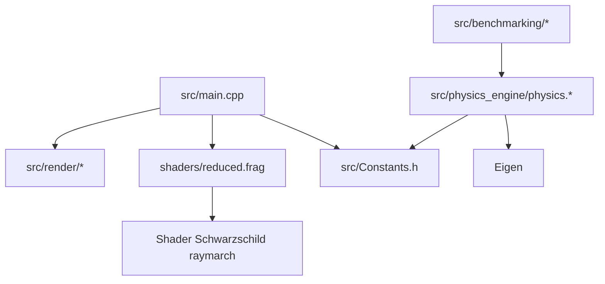
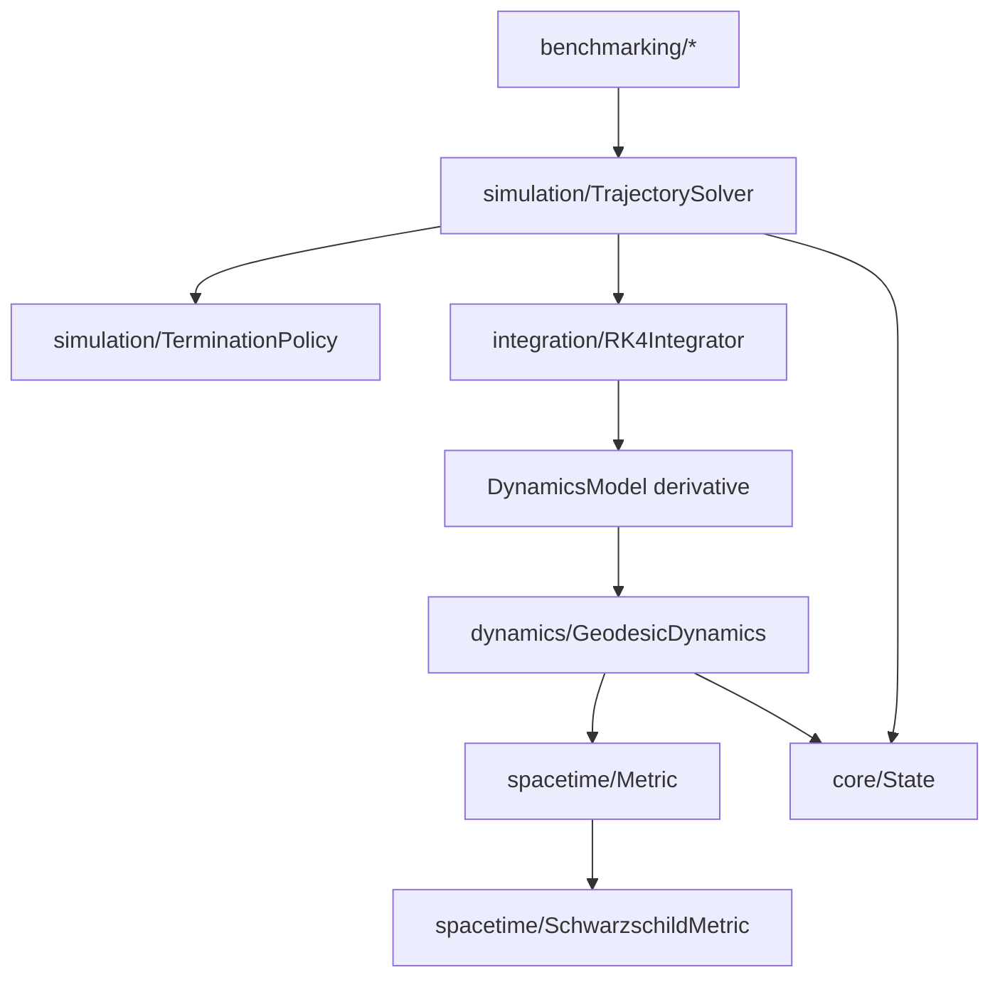
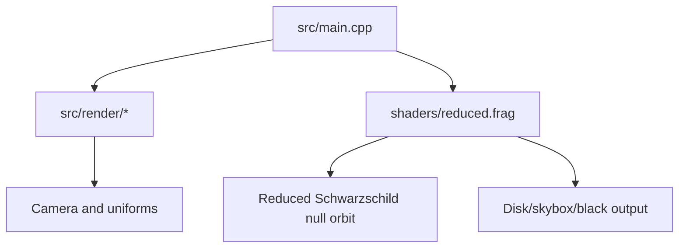
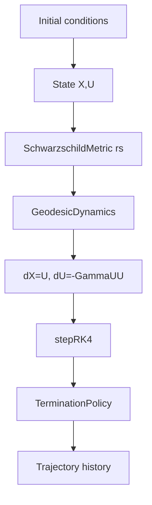
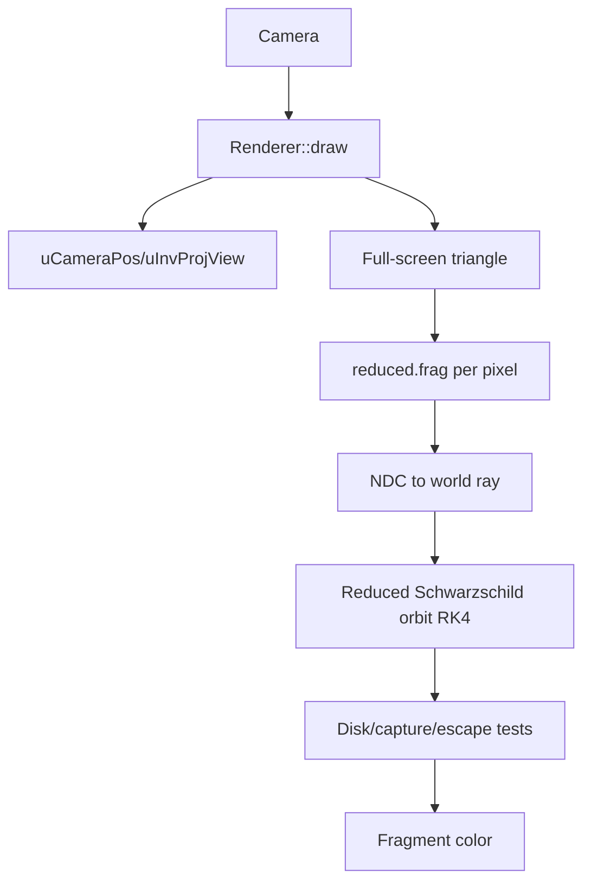
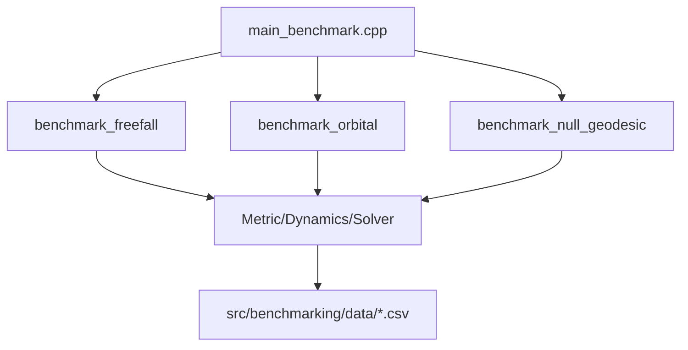

# Penrose Consolidated Architecture Reference

This document is the consolidated architecture reference for Penrose's post-refactor design. It preserves the historical architectural reasoning while explaining the framework shape produced by the refactor: a move from a single Schwarzschild rendering prototype toward a modular general relativistic trajectory framework.

## 1. Historical Overview

Penrose began as a real-time Schwarzschild black hole renderer. The original working system had one successful purpose: produce interactive gravitational lensing by tracing light near a fixed, non-rotating black hole. That implementation combined C++ OpenGL infrastructure with shader-side ray evolution and a CPU physics/benchmark path.

The original architecture was effective as a prototype because it preserved locality: the shader owned the live image, the CPU physics engine owned validation-style geodesic integration, and the benchmark files directly exercised the formulas. The cost was coupling. Schwarzschild-specific constants, Christoffel symbols, RK4 integration, horizon handling, coordinate conversion, and benchmark control flow were not represented as separate architectural concepts.

The refactor became necessary when Penrose's identity shifted from:

> a Schwarzschild black hole engine

to:

> a modular general relativistic simulation framework.

The migration philosophy was preservation-first. The goal was not to redesign the physics or replace validated mathematics. The goal was to extract existing concepts into modules whose names match the mathematics:

- state,
- coordinate chart,
- metric,
- dynamics,
- integrator,
- termination policy,
- trajectory solver.

The key architectural achievement of the refactor is that the CPU geodesic stack now expresses the general structure of relativistic trajectory evolution. The live GPU renderer remains a separate shader-resident path and is the primary remaining alignment task.

## 2. Legacy vs Current Architecture

### Legacy Architecture

The legacy repository organized physics around `src/physics_engine/physics.cpp` and `src/physics_engine/physics.h`.

Legacy responsibilities:

| Concern | Legacy Location | Architectural Character |
|---|---|---|
| State vector | `src/physics_engine/physics.h` | Defined beside particles/lights and physics functions |
| Coordinate transforms | `src/physics_engine/physics.cpp` | Procedural utilities |
| Schwarzschild geometry | `find_acceleration` in `physics.cpp` | Hard-coded Christoffel expressions |
| Dynamics | `find_acceleration` in `physics.cpp` | Mixed with metric evaluation |
| Integration | `Integrator` in `physics.cpp` | RK4 directly calls the hard-coded derivative |
| Termination | `find_acceleration` and benchmark loops | Horizon logic mixed into dynamics/control flow |
| Benchmarks | `src/benchmarking/*` | Own initial conditions, loops, validation output |
| Live rendering | `src/main.cpp`, `src/render/*`, `shaders/reduced.frag` | Shader owns live physics and color |

Legacy dependency graph:



The main executable used the renderer and shaders. The CPU physics engine was valuable but not the live renderer's dependency. This meant Penrose had two related physics implementations: one in C++ for benchmarks, and one in GLSL for pixels.

### Current Post-Refactor Architecture

The post-refactor branch reorganizes the CPU simulation framework into explicit modules:

```text
src/
├── core/
│   └── State.h
├── spacetime/
│   ├── Metric.h
│   ├── SchwarzschildMetric.h/.cpp
│   └── CoordinateChart.h/.cpp
├── dynamics/
│   ├── DynamicsModel.h
│   └── GeodesicDynamics.h/.cpp
├── integration/
│   └── RK4Integrator.h/.cpp
├── simulation/
│   ├── TerminationPolicy.h/.cpp
│   └── TrajectorySolver.h/.cpp
├── benchmarking/
└── render/
```

Current post-refactor responsibilities:

| Subsystem | Purpose | Primary Ownership |
|---|---|---|
| Core | Universal trajectory state | `State { X, U }` |
| Spacetime | Geometry and coordinate mappings | `Metric`, `SchwarzschildMetric`, `CoordinateChart` |
| Dynamics | Equations of motion | `DynamicsModel`, `GeodesicDynamics` |
| Integration | Numerical stepping | `stepRK4` over generic derivative functions |
| Simulation | Loop orchestration and termination | `TrajectorySolver`, `TerminationPolicy` |
| Benchmarking | Scientific validation drivers | Freefall, orbital, null geodesic workflows |
| Rendering | OpenGL display backend | Camera, shader, particles, frame capture |
| Shaders | Live GPU visual algorithm | `reduced.frag` and alternate `quad.frag` |

Post-refactor CPU dependency graph:



The live renderer remains OpenGL and shader driven:



### Direct Legacy-to-Current Mapping

| Legacy Concept | Legacy Location | Current Post-Refactor Location | Responsibility Change |
|---|---|---|---|
| Phase-space state | `physics.h::State` | `src/core/State.h` | State becomes shared payload |
| Particle/light wrappers | `physics.h` | Still partly in `core/State.h`; render particle remains in `render/Particle.h` | Not fully purified yet |
| Spherical/Cartesian Jacobians | `physics.cpp` | `src/spacetime/CoordinateChart.*` | Coordinate handling extracted |
| Schwarzschild Christoffels | `find_acceleration` | `src/spacetime/SchwarzschildMetric.*` | Geometry owns connection coefficients |
| Geodesic contraction | `find_acceleration` | `src/dynamics/GeodesicDynamics.*` | Universal dynamics separated from metric |
| RK4 stepping | `Integrator` | `src/integration/RK4Integrator.*` | Integrator no longer knows gravity |
| Horizon stop | acceleration guard and benchmark checks | `src/simulation/TerminationPolicy.*` | Boundary behavior moved above dynamics |
| Benchmark loops | each benchmark file | `TrajectorySolver::solve` | Loop ownership centralized |
| Global constants | `src/Constants.h` | metric constructor/local benchmark constants | Parameters move toward explicit ownership |
| Live shader physics | `shaders/reduced.frag` | still `shaders/reduced.frag` | Not yet unified with CPU framework |
| Historical docs | scattered/root docs | `docs/architecture/`, `docs/reports/`, `docs/frame_capture/` | Documentation reorganized |

## 3. Refactor Analysis

The refactor was architectural extraction, not algorithmic redesign.

What changed:

- `State` became the shared numerical payload instead of a struct embedded in a physics monolith.
- The Schwarzschild connection moved into a `Metric` implementation.
- The geodesic equation moved into a metric-agnostic `GeodesicDynamics`.
- RK4 became a generic integrator over a derivative callback.
- Benchmark loops moved behind `TrajectorySolver`.
- Horizon detection became a termination policy rather than an acceleration hack.
- Root-level reports and scripts were reorganized into documentation and tooling folders.

What intentionally remained unchanged:

- The validated Schwarzschild Christoffel formulas.
- The geodesic acceleration equation \(a^\mu = -\Gamma^\mu_{\alpha\beta}U^\alpha U^\beta\).
- The fixed-step RK4 numerical method.
- The benchmark intent: verify radial freefall, orbital motion, and null geodesics.
- The OpenGL live rendering strategy: one full-screen draw, one fragment shader ray per pixel.
- The shader-side reduced Schwarzschild visualizer.

The most important responsibility extraction was:

```text
Legacy find_acceleration
  ├── reads global rs
  ├── computes Schwarzschild Christoffels
  ├── contracts geodesic equation
  └── guards horizon behavior

Post-refactor
  ├── SchwarzschildMetric owns Christoffels
  ├── GeodesicDynamics owns contraction
  ├── HorizonTermination owns boundary stop
  └── TrajectorySolver owns loop orchestration
```

This is the refactor's central architectural result.

## 4. Current Framework Architecture

### Core

Purpose: define the universal trajectory payload.

Owned data:

- `State::X`: four-position \(x^\mu\),
- `State::U`: four-velocity/four-tangent \(U^\mu\).

Responsibilities:

- support RK4 algebra through addition and scalar multiplication,
- remain small enough to pass between dynamics, integration, and simulation layers.

Dependencies:

- Eigen for `Vector4d`.

Extension points:

- future typed states for null/timelike/charged trajectories,
- removal of rendering-adjacent `Particle::color` leakage from core.

### Spacetime

Purpose: own geometry.

`Metric` defines the minimal geometry contract:

```text
christoffel(mu, alpha, beta, X)
```

`SchwarzschildMetric` implements this contract for Schwarzschild coordinates and stores `rs` as constructor-owned data.

`CoordinateChart` contains spherical/Cartesian conversions and Jacobians. It is extracted but not yet fully elevated into a polymorphic chart abstraction.

Dependencies:

- Eigen,
- mathematical coordinate conventions.

Extension points:

- `KerrMetric`,
- `ReissnerNordstromMetric`,
- `MinkowskiMetric`,
- `BoyerLindquistChart`,
- chart domain/singularity policies.

### Dynamics

Purpose: own equations of motion.

`DynamicsModel` defines the derivative contract:

```text
State compute_derivative(const State& state)
```

`GeodesicDynamics` implements:

\[
\frac{dX^\mu}{d\lambda}=U^\mu
\]

\[
\frac{dU^\mu}{d\lambda}
=
-\Gamma^\mu_{\alpha\beta}U^\alpha U^\beta
\]

It queries the metric for \(\Gamma^\mu_{\alpha\beta}\), but it does not know the metric's formula.

Extension points:

- charged-particle dynamics,
- forced dynamics,
- wavefront dynamics,
- non-geodesic test-particle models.

### Integration

Purpose: own numerical stepping.

`stepRK4` accepts:

- current state,
- step size,
- derivative function.

It does not know about:

- Schwarzschild,
- horizons,
- null constraints,
- coordinates,
- rendering.

Extension points:

- Euler/RK2 for testing,
- RK45/adaptive methods,
- symplectic methods where appropriate,
- backend-specific integrator variants.

### Simulation

Purpose: own trajectory-loop orchestration.

`TrajectorySolver::solve`:

1. stores the initial state,
2. wraps dynamics in a derivative function,
3. checks termination,
4. advances with RK4,
5. applies optional `post_step`,
6. appends state history.

`TerminationPolicy` abstracts stopping conditions. The implemented policy is `HorizonTermination`.

Extension points:

- escape termination,
- maximum-radius termination,
- composite policies,
- event detection,
- post-step constraint projection.

### Rendering

Purpose: own OpenGL execution and display support.

Key components:

| File | Role |
|---|---|
| `Renderer` | Full-screen triangle, uniforms, particle SSBO binding, framebuffer capture |
| `Shader` | GLSL compilation and uniform helpers |
| `Camera` | Euclidean FPS-style camera and view matrix |
| `Window` | GLFW input and mouse capture |
| `ParticleBuffer` | GL shader storage buffer for render particles |
| `RenderTarget` | Offscreen framebuffer/texture infrastructure |
| `Texture` | Skybox loading |
| `FrameCapture` | PPM capture sessions |

The rendering subsystem is an OpenGL backend, not yet a backend-neutral execution layer.

### Benchmarking

Purpose: validate the CPU physics framework.

Benchmarks configure:

- initial state,
- Schwarzschild metric,
- geodesic dynamics,
- termination policy,
- integration step,
- maximum step count,
- CSV output.

The benchmark system is the main consumer of the post-refactor CPU framework.

## 5. Physics Pipeline

CPU physics pipeline:



Detailed flow:

1. A benchmark constructs \(X^\mu\) and \(U^\mu\).
2. The benchmark constructs `SchwarzschildMetric(rs)`.
3. The benchmark constructs `GeodesicDynamics(metric)`.
4. The benchmark constructs `HorizonTermination(rs, safety_factor)`.
5. `TrajectorySolver::solve` creates a derivative lambda.
6. RK4 evaluates intermediate trial states.
7. For each trial state, `GeodesicDynamics` asks the metric for Christoffel symbols.
8. `GeodesicDynamics` returns a derivative state \([U^\mu, a^\mu]\).
9. RK4 returns the next state.
10. Optional post-step logic can enforce constraints, as in null geodesic benchmarks.
11. The solver appends states until termination or max steps.

Ownership:

| Data | Owner |
|---|---|
| Initial physical parameters | Benchmark caller |
| Metric parameter `rs` | `SchwarzschildMetric` instance |
| Connection coefficients | `Metric` implementation |
| Geodesic contraction | `GeodesicDynamics` |
| Step arithmetic | `RK4Integrator` |
| Loop and history | `TrajectorySolver` |
| Stop condition | `TerminationPolicy` |

## 6. Rendering Pipeline

Live rendering pipeline:



Frame flow:

1. `main.cpp` initializes GLFW/GLAD and creates the window.
2. `main.cpp` loads `shaders/quad.vert` and `shaders/reduced.frag`.
3. `main.cpp` loads the skybox texture.
4. `main.cpp` creates procedural accretion disk particles and uploads them through `Renderer`.
5. Each frame, input updates the Euclidean camera.
6. `Renderer::draw` sends camera position, inverse projection-view matrix, resolution, and flags to the shader.
7. The full-screen triangle invokes the fragment shader for each pixel.
8. `reduced.frag` unprojects the pixel into a world ray.
9. `raymarchReduced` evolves a reduced null orbit in the plane spanned by camera position and ray direction.
10. The shader checks capture, disk crossing, escape, and skybox sampling.
11. The shader writes final RGB.
12. Optional frame capture writes PPM frames.

Where rendering diverges from CPU physics:

- CPU post-refactor physics evolves an 8D state \((X^\mu,U^\mu)\).
- The active shader evolves a reduced orbit using \(u=1/r\) and \(du/d\psi\).
- CPU uses `Metric -> GeodesicDynamics -> RK4 -> TrajectorySolver`.
- GPU uses local GLSL functions `orbitDerivative`, `orbitRK4`, and `raymarchReduced`.
- CPU validates benchmark CSVs; GPU produces pixels.

How shader architecture mirrors CPU concepts:

| CPU Concept | Shader Equivalent |
|---|---|
| Initial state | `ro`, `rd`, derived orbital plane |
| Metric/dynamics | `dv = -u + 1.5 * rs * u * u` |
| Integrator | `orbitRK4` |
| Simulation loop | `for MAX_ORBIT_STEPS` in `raymarchReduced` |
| Termination | capture/escape checks |
| Scene | disk plane crossing and skybox sampling |

The mirror is conceptual, not code-shared.

## 7. Benchmarking Pipeline

Benchmark execution:



Freefall benchmark:

- constructs radial infall initial conditions,
- compares numerical horizon crossing to analytic proper time,
- writes `freefall.csv`.

Orbital benchmark:

- computes \(U^t\) from timelike normalization,
- tracks norm, energy, angular momentum,
- writes `orbital.csv`.

Null geodesic benchmark:

- computes \(U^t\) from null normalization,
- tracks Hamiltonian/null constraint error,
- tracks energy and angular momentum drift,
- uses `post_step` to periodically reproject the null constraint,
- writes impact-parameter-specific CSV files.

Refactor impact:

- benchmark files no longer own the whole integration loop,
- benchmarks configure the framework,
- validation logic remains in benchmark-specific code,
- CSV output remains a benchmark responsibility.

## 8. Pipeline Comparison

| Pipeline | Legacy | Post-Refactor |
|---|---|---|
| CPU physics | Benchmark calls monolithic `Integrator` | Benchmark configures Metric/Dynamics/Solver |
| Metric evaluation | Inside `find_acceleration` | Inside `SchwarzschildMetric` |
| Dynamics | Mixed with Christoffel formulas | `GeodesicDynamics` contracts any `Metric` |
| Integration | RK4 calls fixed derivative | RK4 accepts generic derivative |
| Termination | Benchmark checks and acceleration guard | `TerminationPolicy` |
| Rendering | Shader owns physics/color | Still shader-owned; not yet unified |
| Documentation | Root reports and review notes | Historical docs grouped under architecture/reports/frame_capture |

Convergence:

- Both CPU and GPU still model Schwarzschild light/motion.
- Both use RK4-style stepping.
- Both use horizon and escape concepts.

Divergence:

- CPU framework is modular.
- GPU framework is monolithic GLSL.
- CPU uses `rs=1.0` in benchmarks.
- GPU uses `rs=0.25` in shaders.

## 9. Data Flow Analysis

### Core

Data form:

```text
State
  X: Eigen::Vector4d
  U: Eigen::Vector4d
```

Lifetime:

- created by benchmark initial condition,
- copied through RK4 trial states,
- stored in solver history.

Transformations:

- RK4 algebra adds/scales states,
- dynamics computes derivative state,
- optional post-step callbacks adjust constraints.

### Spacetime

Input:

- position \(X^\mu\).

Output:

- Christoffel symbol \(\Gamma^\mu_{\alpha\beta}(X)\),
- coordinate transforms where used.

Lifetime:

- metric instance survives for the benchmark solve,
- chart utilities are stateless.

### Dynamics

Input:

- `State`,
- metric reference.

Output:

- derivative state \([U^\mu,a^\mu]\).

Transformation:

\[
a^\mu=-\Gamma^\mu_{\alpha\beta}U^\alpha U^\beta.
\]

### Integration

Input:

- current state,
- step size,
- derivative function.

Output:

- next state.

Transformation:

- RK4 weighted slope average.

### Simulation

Input:

- initial state,
- dynamics,
- termination policy,
- step size,
- maximum steps,
- optional post-step function.

Output:

- vector of states.

Lifetime:

- owns history for the duration of solve and returns it.

### Rendering

Input:

- camera state,
- skybox texture,
- shader source,
- particle buffer,
- framebuffer dimensions.

Output:

- fragment colors,
- optional PPM image sequence.

Transformation:

- camera matrix to world ray,
- shader ray evolution to RGB.

### Benchmarking

Input:

- physical scenario parameters.

Output:

- terminal diagnostics,
- CSV files,
- notebooks/plots consuming CSV.

## 10. Architectural Philosophy

Penrose's architectural philosophy is now:

1. Preserve validated mathematics.
2. Extract concepts along scientific boundaries.
3. Let future capabilities arrive through extension.
4. Keep numerical integration independent of physics.
5. Keep metrics independent of equations of motion.
6. Keep rendering as a consumer of trajectory evolution, not the owner of it.

The refactor's most important philosophical shift is separating geometry from motion:

- Geometry answers: "What is spacetime here?"
- Dynamics answers: "How does a state move through that geometry?"
- Integration answers: "How do we numerically step the ODE?"
- Simulation answers: "When do we stop and what history do we keep?"
- Rendering answers: "How is a trajectory turned into a visible pixel?"

This is the architecture of a scientific computing framework rather than a one-off renderer.

## 11. Extension Model

### Kerr Metric

Add:

- `src/spacetime/KerrMetric.h/.cpp`,
- likely `BoyerLindquistChart`,
- Kerr-specific horizon termination.

Untouched:

- `GeodesicDynamics`,
- `RK4Integrator`,
- `TrajectorySolver`.

Reason:

- geodesic contraction is metric-independent.

### Reissner-Nordstrom Metric

Add:

- `ReissnerNordstromMetric` with mass and charge parameters,
- charge-aware horizon policy if needed.

Untouched:

- integration,
- simulation loop,
- standard geodesic dynamics.

### Solar Gravitational Lens

Add or refine:

- solar spacetime/weak-field metric model,
- high-precision coordinate and scale policies,
- observer/source geometry,
- likely offline/backend strategy.

Untouched in principle:

- `State`,
- derivative/integrator contract,
- broad Metric/Dynamics split.

This is a larger capability expansion because precision, length scale, and observer/source modeling become architectural concerns.

### Alternative Integrators

Add:

- `RK45Integrator`,
- adaptive step policy,
- error estimate interface.

Untouched:

- `Metric`,
- `GeodesicDynamics`,
- benchmark scenario definitions except for selecting the integrator.

## 12. Remaining Architectural Roadmap

Foundational work completed in the post-refactor branch:

- physics monolith dismantled,
- metric interface introduced,
- Schwarzschild metric extracted,
- geodesic dynamics generalized,
- RK4 made physics-agnostic,
- trajectory solver introduced,
- horizon termination extracted.

Architectural refinement still needed:

- remove rendering-adjacent data from `core/State.h`,
- formalize coordinate chart domains and singularity handling,
- implement escape/composite termination policies,
- align benchmark constants and shader constants,
- make benchmark output paths configurable,
- clarify duplicate particle types.

Future capability expansion:

- CPU/GPU architecture alignment,
- shader-side decomposition matching CPU concepts,
- observer/tetrad abstraction,
- scene query abstraction,
- material/emission/observable model,
- backend contracts for CPU, OpenGL, compute, CUDA, Vulkan, and offline modes,
- validation across metrics, integrators, and backends.

The largest remaining architectural task is unifying the modular CPU framework and the live GPU renderer under a shared conceptual contract.

## 13. Repository Navigation Guide

### If you are new to the project

Start with:

1. `docs/architecture/consolidated-architecture-reference.md` for architecture.
2. `docs/PROJECT_DOCUMENTATION.md` for current main-branch project notes.
3. `src/main.cpp` to see the live application loop.
4. `shaders/reduced.frag` to see the active pixel physics.
5. `src/physics_engine/physics.cpp` on `main` or `src/spacetime` plus `src/dynamics` on the post-refactor branch to understand CPU physics.

### Where functionality belongs

| Functionality | Correct Home |
|---|---|
| Universal state data | `src/core/` |
| Metric tensors/connections | `src/spacetime/` |
| Coordinate transforms/domains | `src/spacetime/` |
| Equations of motion | `src/dynamics/` |
| ODE stepping | `src/integration/` |
| Trajectory loops and stop rules | `src/simulation/` |
| Scientific validation | `src/benchmarking/` |
| OpenGL utilities | `src/render/` |
| Live GLSL raymarching | `shaders/` |
| Frame/video tooling | `scripts/`, `docs/frame_capture/` |
| Historical reviews/specs | `docs/architecture/` |

### Where future implementations should be added

- New spacetime: `src/spacetime/`.
- New dynamics law: `src/dynamics/`.
- New integrator: `src/integration/`.
- New benchmark: `src/benchmarking/`.
- New simulation stop condition: `src/simulation/`.
- New render pass/backend support: `src/render/` or a future backend directory.
- New shader experiment: `shaders/`, with matching documentation.

## 14. Overall Architectural Summary

Penrose's legacy architecture proved the physics and rendering concept: Schwarzschild light bending can be rendered interactively, and CPU geodesic benchmarks can validate related equations.

The post-refactor architecture turns the CPU side into a modular scientific framework:

```text
State -> Metric -> GeodesicDynamics -> RK4Integrator -> TrajectorySolver
```

This structure is the correct foundation for future GR simulations because it maps software boundaries to mathematical boundaries.

The live renderer has not yet completed the same transition. It remains a shader-resident Schwarzschild visualizer, using `reduced.frag` as the active physics/color pipeline. That is acceptable as a preserved working backend, but it should be understood as the next major alignment target.

The intended future is not to discard the shader renderer. It is to make the shader renderer one backend that executes the same conceptual architecture already established in the CPU framework.

## 15. Running Penrose Features

### Build the main visualizer

From the repository root:

```bash
cmake -S . -B build
cmake --build build
```

Run:

```bash
./build/Penrose
```

Depending on generator/platform, the executable may be under a configuration directory such as `build/Debug/Penrose`.

### Controls

Current controls:

| Input | Action |
|---|---|
| WASD | Move camera |
| Mouse | Look around when captured |
| Tab | Toggle cursor capture |
| Left/Right Shift | Sprint multiplier |
| P | Toggle frame capture |
| Escape | Exit or release/capture depending on current input path |

### Frame capture

While running the visualizer, press `P`. Frames are written as PPM files under:

```text
imagesequence/<timestamp>/frame_000000.ppm
```

### Convert PPM sequence to video

On branches containing the script in `scripts/`:

```bash
python scripts/ppm_to_video.py
```

On `main`, the script may still be at the repository root depending on checkout state:

```bash
python ppm_to_video.py
```

Follow the interactive prompts to select the image sequence and frame rate.

### Run CPU benchmarks

On `main`, the benchmark sources exist but are not wired into the shown `CMakeLists.txt` target. Build/run instructions may require manual compilation or a benchmark-specific build setup.

On the post-refactor branch, `CMakeLists.txt` defines:

```text
benchmark_test
```

Build:

```bash
cmake -S . -B build
cmake --build build --target benchmark_test
```

Run:

```bash
./build/benchmark_test
```

The benchmark pipeline writes CSV outputs under `src/benchmarking/data/` in the post-refactor layout.


