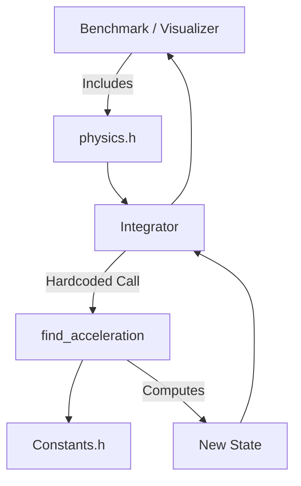
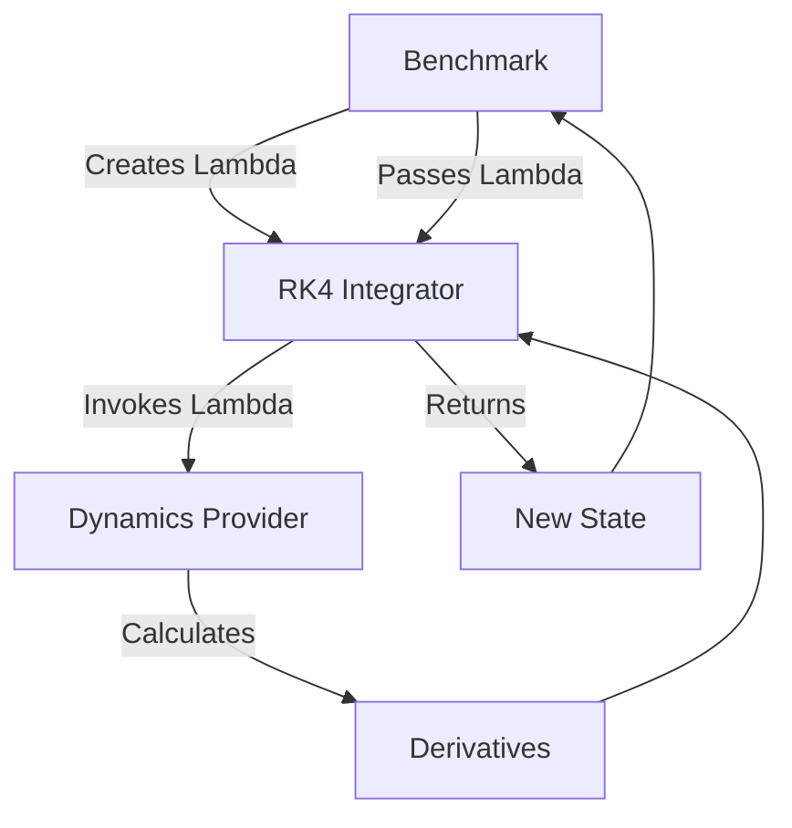

# Penrose Refactor Summary

## 1. Overview and Key Differences

The legacy Penrose codebase relied on a monolithic `src/physics_engine/physics.cpp` file that housed the numerical state representation, coordinate charting, metric definitions, geodesic dynamics, and the RK4 integration loop all interwoven into tightly coupled functions. 

The architecture has now been extracted into a modular pipeline representing the distinct physical and mathematical boundaries of General Relativity and numerical analysis.

### Major Changes vs. Legacy
- **No Monolith**: `src/physics_engine` was entirely dismantled and deleted.
- **Pure Integrators**: The Runge-Kutta numerical solver is completely agnostic to physics. It no longer depends on `Constants.h`, the Schwarzschild metric, or coordinate transforms.
- **Explicit Interfaces**: Callers (benchmarks) now construct the simulation loop by mapping a `Dynamics` derivative provider directly into an `Integrator`, rather than blindly invoking a generic `Integrator(State)` function.
- **Root Cleanup**: Auxiliary scripts and markdown documentation have been shifted to `scripts/` and `docs/` respectively, decluttering the project root.

---

## 2. Refactor Step-by-Step

### Phase 1: State Extraction (`src/core`)
- **Legacy**: `State` (a struct holding 4D position and 4D velocity) was defined at the top of `physics.h`.
- **Refactor**: Extracted into `src/core/State.h`. It now serves as the universal data structure passed between isolated subsystems.

### Phase 2: Coordinate Chart Extraction (`src/spacetime`)
- **Legacy**: Coordinate Jacobian matrices (`sph_to_cart_Jacobian`, etc.) were hardcoded into `physics.cpp`.
- **Refactor**: Extracted into `src/spacetime/CoordinateChart.h/cpp`. They operate independently on Cartesian and Spherical geometries.

### Phase 3: Dynamics Extraction (`src/dynamics`)
- **Legacy**: `find_acceleration(State)` lived in `physics.cpp`, mixing Christoffel symbol calculation and the geodesic equations.
- **Refactor**: Encapsulated into `LegacyDynamics.h/cpp`. This forms the temporary boundary for the Geodesic equations.

### Phase 4: Integrator Extraction (`src/integration`)
- **Legacy**: The `Integrator(State)` function hardcoded an RK4 loop that automatically invoked `find_acceleration`.
- **Refactor**: Replaced with `Integration::stepRK4` in `src/integration/RK4Integrator.h/cpp`. It accepts a generic `std::function<State(const State&)>`, completely severing the numerical solver's compile-time dependency on General Relativity.

### Phase 5: Caller Redirection
- **Legacy**: Benchmarks included `physics.h`.
- **Refactor**: Benchmarks include `State.h`, `LegacyDynamics.h`, and `RK4Integrator.h`. They construct a lambda that wires the dynamics into the integrator.

---

## 3. Architecture & Data Flow

### Legacy Pipeline Data Flow

*Issue: The integrator was permanently married to Schwarzschild dynamics.*

### Refactored Pipeline Data Flow

*Benefit: The integrator only sees math. The physics provider only sees states. The caller decides how they connect.*

---

## 4. Module Overview

- **`src/core/`**: Fundamental universal types.
  - `State.h`: The $(X^\mu, U^\mu)$ state vector definition.
- **`src/dynamics/`**: Engines that define the equations of motion.
  - `LegacyDynamics.h/cpp`: The isolated Schwarzschild geodesic equations.
- **`src/integration/`**: Numerical solvers.
  - `RK4Integrator.h/cpp`: A generic 4th-order Runge-Kutta stepper.
- **`src/spacetime/`**: Geometry and mapping.
  - `CoordinateChart.h/cpp`: Jacobian transformations for Spherical-to-Cartesian projections.
- **`scripts/`**: Auxiliary project tools.
  - `ppm_to_video.py`: Script to convert visualizer frame captures into MP4 videos.

---

## 5. Running the Project

### Running the Visualizer (Penrose)
The main application renders the accretion disk simulation using GPU shaders (the rendering pipeline remains procedurally decoupled from the CPU physics, but utilizes the C++ codebase for setup).
```bash
# Configure and Build
cmake -S . -B build
cmake --build build

# Run the simulation
./build/Penrose
```

### Capturing Video
While running `Penrose`, press `C` to toggle frame capture. Frames will be dumped to `imagesequence/`.
To compile these into a video:
```bash
# Ensure dependencies are installed
pip install -r requirements.txt

# Run the conversion script
python scripts/ppm_to_video.py
# (Follow the interactive prompts to locate your imagesequence folder)
```

### Running the Scientific Benchmarks
The CPU pipeline executes exact numerical verifications of null geodesics, freefall, and orbital dynamics.
```bash
# Build the benchmark suite
cmake -S . -B build_bench -f CMakeLists_benchmarks.txt
cmake --build build_bench --target benchmark_test
# OR manually compile if CMake configuration relies on the root:
g++ src/benchmarking/main_benchmark.cpp src/benchmarking/orbital.cpp src/benchmarking/null_geodesic.cpp src/benchmarking/freefall.cpp src/spacetime/CoordinateChart.cpp src/dynamics/LegacyDynamics.cpp src/integration/RK4Integrator.cpp -I src/ -I vendor/ -o benchmark_test

# Execute
./benchmark_test
```
This produces `orbital.csv`, `null_geodesic.csv`, and `freefall.csv` in `src/benchmarking/data/`.
