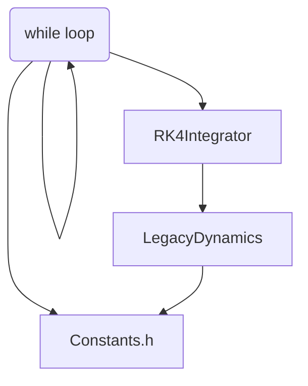
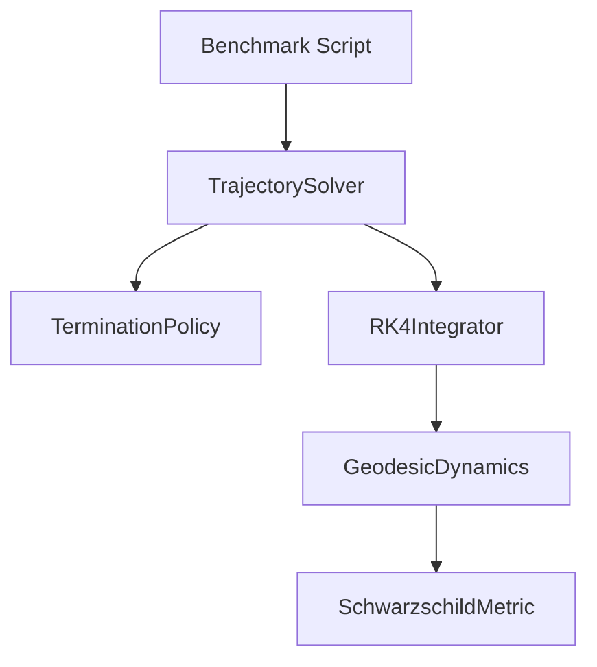

# Penrose Architecture Refinement Summary

This document summarizes the architectural refinements made to transition Penrose from a monolithic physics engine into a modular, extensible, and first-principles-based General Relativity simulation framework.

## 1. Goal of the Refactoring

The legacy code closely coupled the numerical integration (RK4), the metric properties, and the constraint/termination logic inside a single `Constants.h` and benchmark loops. This made it difficult to introduce new metrics (like Kerr) or test alternative dynamics without rewriting the core loop.

The refined architecture decouples the system into distinct, composable abstractions:
- **Geometry (Spacetime)**
- **Physics (Dynamics)**
- **Simulation Orchestration**
- **Numerical Integration**

## 2. Abstraction Overview & Module Map

### `src/core/State` (Unchanged)
The fundamental data structure.
- Represents a particle's state in phase space: $X^\mu$ (position) and $U^\mu$ (4-velocity).
- No mathematical changes were made to `State.h`.

### `src/spacetime/` (New)
Encapsulates all geometric properties of the spacetime manifold.
- **`Metric`** (Interface): Defines the contract for any spacetime geometry. It requires implementations for the metric tensor $g_{\mu\nu}$, its inverse $g^{\mu\nu}$, and the Christoffel symbols $\Gamma^\lambda_{\mu\nu}$.
- **`SchwarzschildMetric`**: The first concrete implementation of `Metric`. It encapsulates the algebraic expressions previously hardcoded into `LegacyDynamics.cpp`.

### `src/dynamics/` (Refined)
Encapsulates the equations of motion.
- **`DynamicsModel`** (Interface): Defines the contract for computing the 4-acceleration $a^\mu = \frac{dU^\mu}{d\tau}$.
- **`GeodesicDynamics`**: The primary implementation of `DynamicsModel`. It computes the geodesic equation $a^\mu = -\Gamma^\mu_{\alpha\beta} U^\alpha U^\beta$ by querying the provided `Metric` object, remaining completely agnostic to the underlying geometry.
- *(Note: `LegacyDynamics` was removed as its responsibilities are now cleanly split between `SchwarzschildMetric` and `GeodesicDynamics`.)*

### `src/integration/` (Unchanged)
Handles purely mathematical state advancement.
- **`RK4Integrator`**: Implements the 4th-order Runge-Kutta method. It is now strictly restricted to mathematical state advancement and no longer handles any termination or physical domain logic.

### `src/simulation/` (New)
Orchestrates the entire simulation loop.
- **`TerminationPolicy`** (Interface): Decides when a simulation should halt.
  - **`HorizonTermination`**: Halts the simulation if the particle crosses an event horizon.
  - **`EscapeTermination`**: Halts the simulation if the particle escapes to a large radius.
  - **`CompositeTermination`**: Allows combining multiple policies.
- **`TrajectorySolver`**: The core orchestrator. It manages the `while` loop, invoking the `RK4Integrator` to step forward, checking the `TerminationPolicy` at each step, and storing the resulting trajectory in a history vector. It also supports an optional `post_step` callback for specialized coordinate projections (e.g., enforcing the null constraint $U_\mu U^\mu = 0$ for photons).

## 3. Data Flow & Dependency Graph

### Legacy Flow

*In the legacy design, the benchmark script owned the while loop, managed termination manually, and relied heavily on global state in `Constants.h`.*

### New Flow

*In the refined architecture:*
1. The caller (e.g., `benchmark_orbital`) instantiates a `Metric`, a `DynamicsModel` linked to that metric, and a `TerminationPolicy`.
2. The caller invokes `TrajectorySolver::solve(...)`, passing these components.
3. `TrajectorySolver` owns the `while` loop. At each step, it asks `RK4Integrator` to advance the state.
4. `RK4Integrator` calls `GeodesicDynamics::compute_acceleration(...)` to evaluate derivatives.
5. `GeodesicDynamics` queries `SchwarzschildMetric` for Christoffel symbols.
6. `TrajectorySolver` evaluates the `TerminationPolicy` and returns the complete history.

## 4. Where Did Everything Go?

For external users familiar with the legacy code, here is a mapping of the old concepts to the new architecture:

- **`src/Constants.h`**: **Removed**. Global variables like `rs` (Schwarzschild radius) are now encapsulated within `SchwarzschildMetric` and local benchmark scopes.
- **`src/dynamics/LegacyDynamics.cpp`**: **Removed**. The Christoffel symbol algebra is now in `src/spacetime/SchwarzschildMetric.cpp`. The geodesic acceleration equation $a^\mu = -\Gamma^\mu_{\alpha\beta} U^\alpha U^\beta$ is now in `src/dynamics/GeodesicDynamics.cpp`.
- **`while` loops in `src/benchmarking/`**: Replaced by `Simulation::TrajectorySolver::solve()`. The benchmark scripts now simply define the initial state, configure the simulation abstractions, and invoke the solver.
- **Manual boundary checks (e.g., `r_ <= rs`)**: Replaced by `Simulation::HorizonTermination`.

## 5. Summary

The engine is now architecturally prepared for advanced extensions. Because `GeodesicDynamics` operates purely on the `Metric` interface, implementing Kerr spacetime, or even a numerical metric interpolated from numerical relativity data, now requires zero modifications to the integrator or the dynamics layers—only a new implementation of `Metric` is required.
