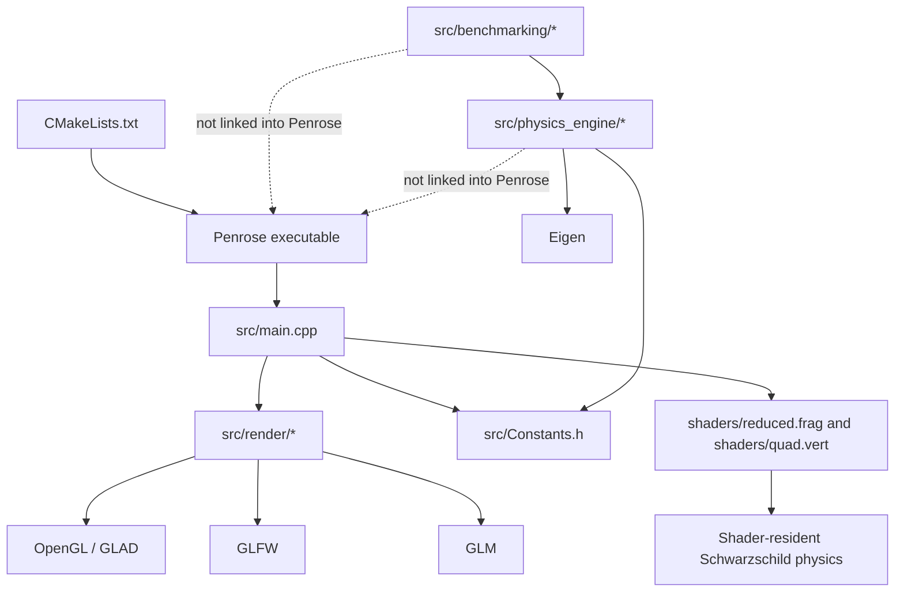

# Deep Architectural Review: Penrose

> **Historical / non-normative.** Pre-refactor review describing an earlier `src/`-style layout.
> It is not the source of truth for the current repository (`run/`, `penrose_physics`,
> dual Stage 3 trajectory backends, separate `realtime/` ray march).
> Current reference: [`../ARCHITECTURE.md`](../ARCHITECTURE.md).

## 1. Executive Summary

Penrose is currently best understood as a real-time Schwarzschild black-hole renderer with supporting CPU validation code, not yet as a general-purpose relativistic ray tracing framework.

The repository contains valuable ingredients for a future framework: a spacetime state representation, geodesic integration logic, coordinate transforms, GPU raymarching, CPU benchmarks, rendering infrastructure, and documentation that explains the mathematical model. However, those ingredients are not organized around stable framework abstractions. The current architecture is centered on one rendered physical system: a fixed Schwarzschild spacetime, rendered through OpenGL fragment shaders, using hard-coded numerical and scene assumptions.

The most important architectural finding is that the live executable does not consume a reusable physics engine. `CMakeLists.txt` builds `src/main.cpp` and the `src/render/` implementation files into `Penrose`, but it does not build or link `src/physics_engine/physics.cpp` or the benchmark programs. The live physical algorithm is selected by a shader filename in `src/main.cpp`:

```cpp
Shader blackHoleShader("shaders/quad.vert", "shaders/reduced.frag");
```

That means the primary extension point for changing physics today is not a metric interface, integrator interface, coordinate-system interface, or scene interface. It is changing shader code.

The second major finding is that the repository has two different physics paths:

- The active GPU path in `shaders/reduced.frag` uses a reduced orbital-plane formulation based on `u = 1/r` and `du/dpsi`.
- The CPU path in `src/physics_engine/physics.cpp` uses an eight-dimensional state `(x^mu, u^mu)`, Schwarzschild Christoffel symbols, and fixed-step RK4.
- The legacy/full GPU path in `shaders/quad.frag` resembles the CPU geodesic approach but is not the shader selected by the current executable.

These paths share concepts, but not code, interfaces, parameters, or build ownership. For a research prototype, that is acceptable. For a decade-scale scientific computing framework, it is the central architectural risk.

The overall verdict is:

Penrose cannot currently evolve primarily through extension into a general relativistic ray tracing framework. It will require a foundational architectural redesign before new metrics, coordinate systems, integrators, ray types, rendering modes, and execution backends can be added as modules rather than as edits to core shader and application files.

This does not mean the project should be discarded. It means the current implementation is a strong Schwarzschild visualization prototype and an excellent source of domain knowledge, but its architecture has not yet crossed the boundary into framework design.

## 2. Current Framework Identity

Penrose is currently a Schwarzschild gravitational lensing renderer with experimental CPU geodesic validation.

It is not yet a general ray tracing framework because there is no stable ray-evolution abstraction independent of rendering. It is not yet a numerical relativity framework because the spacetime geometry is fixed, the metric is not represented as a first-class object, and Einstein-equation evolution is out of scope. It is not yet a general scientific simulation framework because the main executable is an OpenGL application whose physical model lives in GLSL shader functions.

The current identity is locked in by the following implementation facts:

- `CMakeLists.txt` builds only `src/main.cpp`, `src/render/Texture.cpp`, `src/render/Window.cpp`, `src/render/Renderer.cpp`, `src/render/ParticleBuffer.cpp`, and `src/render/RenderTarget.cpp` into the `Penrose` executable.
- `src/physics_engine/physics.cpp` is not part of the live target, even though it contains a reusable-looking `State`, `find_acceleration`, and `Integrator`.
- `src/main.cpp` directly selects `shaders/reduced.frag`, making shader source the active physics module.
- `shaders/reduced.frag` hard-codes Schwarzschild radius, disk radii, step size, and maximum orbit steps.
- `src/Constants.h` defines `rs = 1.0`, while the active shader defines `rs = 0.25`; the CPU and GPU paths are therefore not a single parameterized physical system.
- `src/render/Camera.h` implements a standard Euclidean graphics camera using `glm::lookAt`; there is no relativistic observer model or tetrad abstraction.
- `src/main.cpp` procedurally creates accretion-disk particles, animates their azimuthal positions kinematically, and uploads them through the renderer, while the active shader renders its own procedural disk crossing test and does not consume the SSBO particle data for the visual disk.

The current framework identity is therefore closer to "interactive Schwarzschild renderer" than "relativistic ray tracing framework."

## 3. Architectural Overview

The repository is organized into the following effective subsystems.

### Application Shell

Owned by `src/main.cpp`.

This subsystem owns process startup, GLFW initialization, OpenGL context creation, shader selection, skybox loading, procedural disk-particle generation, the render loop, frame timing, particle animation, and frame capture triggering.

Its responsibility is broad. It does not merely assemble subsystems; it also decides the active physical algorithm by selecting `shaders/reduced.frag`, defines scene content procedurally, manages render resolution decisions, and updates particle positions. This makes `src/main.cpp` an orchestration file, scene definition, backend selector, and partial simulation owner at the same time.

### Render Backend

Owned by `src/render/`.

This subsystem wraps OpenGL mechanics:

- `Renderer` owns the fullscreen triangle VAO/VBO and a `ParticleBuffer`.
- `ParticleBuffer` owns an OpenGL SSBO and uploads `std::vector<Particle>` data with `glBufferData`.
- `Shader` compiles GLSL programs and sets uniforms.
- `Texture` loads the skybox texture through `stb_image`.
- `RenderTarget` owns an offscreen framebuffer and texture.
- `FrameCapture` owns frame sequence paths and capture state.
- `Window` owns GLFW input handling and mouse callbacks.
- `Camera` owns a graphics camera pose and view matrix.

This subsystem is cohesive as an OpenGL support layer. It is not a renderer abstraction in the framework sense because it exposes OpenGL concepts directly and the physics contract is implicit in shader uniforms rather than a backend-independent rendering interface.

### Active GPU Physics

Owned by `shaders/reduced.frag`.

This is the live physical raymarcher. It defines:

- `orbitDerivative`
- `orbitRK4`
- `orbitPosition`
- `raymarchReduced`
- `DirectionToUV`

The active shader solves the reduced Schwarzschild null-orbit equation in an orbital plane:

```glsl
dv = -u + 1.5 * rs * u * u;
```

It reconstructs world-space positions, checks whether the ray crosses a fixed disk plane, checks capture at `r <= rs * 1.001`, checks escape at `r > 30.0`, and samples the skybox.

This is not a general metric engine. It is a specialized analytic reduction for Schwarzschild null geodesics.

### Legacy or Alternate GPU Physics

Owned by `shaders/quad.frag`.

This shader contains a fuller eight-dimensional null-geodesic approach:

- A `ray` state with `vec4 x` and `vec4 u`.
- Cartesian to spherical conversion.
- Schwarzschild Christoffel acceleration in `find_acceleration`.
- RK4 integration in `integrate`.
- Null initialization through a Schwarzschild metric constraint.
- Horizon, disk, and skybox termination.

Architecturally, this file shows an earlier or alternate direction closer to a general ODE-based ray engine. However, it is not the active shader selected in `src/main.cpp`. It also still hard-codes Schwarzschild formulas, disk behavior, OpenGL data layout, and step-control behavior in one file.

### CPU Physics Engine

Owned by `src/physics_engine/physics.h` and `src/physics_engine/physics.cpp`.

This subsystem defines:

- `State`, containing `Eigen::Vector4d X` and `Eigen::Vector4d U`.
- Coordinate Jacobians between spherical and Cartesian coordinates.
- `cart_to_sphere` and `sph_to_cart`.
- `find_acceleration`, using hard-coded Schwarzschild Christoffel symbols.
- `create_state_derivate`.
- `Integrator`, using fixed-step RK4 and global `dt`.

This subsystem is the closest current code to a reusable numerical core, but it is not architecturally connected to the live renderer. It is also not generalized: the metric, coordinate system, connection, ray type, and integrator are all fixed by implementation rather than supplied through abstractions.

### Benchmarking and Validation

Owned by `src/benchmarking/`.

This subsystem contains separate programs for freefall, orbital motion, and null geodesic validation. The benchmark driver in `src/benchmarking/main_benchmark.cpp` calls benchmark functions and uses `src/Constants.h`. `src/benchmarking/null_geodesic.cpp` computes null initial conditions, tracks conserved quantities, exports CSV, and periodically corrects `u^t`.

This subsystem is scientifically valuable, but architecturally separate. It validates the CPU physics path, not the active `reduced.frag` shader path.

### Post-Processing and Documentation

Owned by files such as `ppm_to_video.py`, notebooks under `src/benchmarking/`, `lightcone/lightcone.py`, `docs/PROJECT_DOCUMENTATION.md`, and the first-principles documents.

These files support explanation, analysis, plotting, and video creation. They are not part of the runtime framework.

## 4. Dependency Graph

The current effective dependency graph is:



Important architectural observations:

- The live executable depends on render infrastructure and shader files, not on the CPU physics engine.
- `Eigen3::Eigen` is linked to the `Penrose` target in `CMakeLists.txt`, but the executable sources do not use the CPU physics engine where Eigen is meaningful.
- Runtime physics depends on OpenGL shader execution because the active geodesic/lensing algorithm is implemented in GLSL.
- There is no dependency inversion from renderer to physics abstractions. Instead, the renderer binds uniforms and a particle buffer, then the shader decides physical behavior.
- Benchmarking depends on CPU physics, but CPU physics does not define a shared contract consumed by the renderer.

The dependency direction is therefore application-renderer-shader, not framework-core-backend.

## 5. Subsystem Responsibilities

### `src/main.cpp`

Actual responsibilities:

- Initialize GLFW and GLAD.
- Create the OpenGL window.
- Create `RenderTarget`, `Shader`, `Renderer`, and `FrameCapture`.
- Load the skybox texture.
- Generate procedural accretion-disk particles.
- Animate those particles using a simple azimuthal velocity law.
- Upload particles to the renderer each frame.
- Decide the active shader path.
- Drive the main render loop.
- Trigger frame capture.

Architectural assessment:

`src/main.cpp` owns too many framework-level decisions. A future framework should treat metric selection, scene construction, backend selection, camera/observer configuration, render passes, and simulation updates as separate concerns. In the current design they converge in the entry point.

### `src/render/Renderer.*`

Actual responsibilities:

- Own fullscreen triangle GPU objects.
- Set uniforms for time, resolution, camera position, inverse projection-view matrix, and high-quality pass flags.
- Bind the particle SSBO and skybox texture.
- Draw the fullscreen triangle.
- Read back framebuffer pixels to PPM.

Architectural assessment:

`Renderer` is a useful OpenGL adapter, but it is not backend-neutral. It knows about the exact uniform names expected by the black-hole shader. It also assumes the render operation is screen-space raymarching over a fullscreen triangle. That is appropriate for the current application but too specific for a framework that may need CPU, CUDA, Vulkan, compute shaders, and offline batch renderers.

### `src/render/Camera.h`

Actual responsibilities:

- Maintain Euclidean position, front, up, right vectors.
- Convert yaw and pitch into a graphics camera basis.
- Produce a `glm::lookAt` view matrix.

Architectural assessment:

The camera is isolated as a graphics utility, but it is not a relativistic observer. A general framework eventually needs a camera or observer abstraction that can produce initial ray states in a spacetime-aware way, likely through local frames or tetrads. The current graphics camera can remain as a frontend camera, but it should not be the only owner of ray initial conditions.

### `shaders/reduced.frag`

Actual responsibilities:

- Generate per-pixel world-space rays from inverse projection-view matrix.
- Integrate a reduced Schwarzschild null-orbit equation.
- Detect disk crossings against a fixed world `z = 0` plane.
- Apply procedural disk coloring.
- Detect capture and escape.
- Sample skybox.
- Output final color.

Architectural assessment:

This file currently owns physics, numerics, scene intersection, material/color logic, termination policy, and backend execution. It is the strongest example of responsibility concentration in the codebase. Adding future capabilities would usually mean editing this file or replacing it with another monolithic shader.

### `shaders/quad.frag`

Actual responsibilities:

- Represent a four-position/four-tangent ray.
- Convert between Cartesian and spherical coordinates.
- Compute Schwarzschild Christoffel symbols.
- Initialize a null ray.
- Integrate with RK4.
- Handle horizon, pole, disk, and skybox logic.

Architectural assessment:

This file contains a more general-looking geodesic structure than `reduced.frag`, but it still bundles all responsibilities into a shader. It also hard-codes Schwarzschild coordinates and a specific rendering scene. It is evidence that the repository already has pieces of a framework core conceptually, but they are not yet architectural modules.

### `src/physics_engine/physics.*`

Actual responsibilities:

- Define CPU geodesic state.
- Implement coordinate transforms.
- Implement Schwarzschild acceleration.
- Implement fixed-step RK4.

Architectural assessment:

This is the natural seed of a physics core. Its current limitation is that it is not a physics core interface; it is a Schwarzschild RK4 implementation. It has no metric abstraction, no coordinate abstraction, no integrator abstraction, no ray-type abstraction, and no backend-independent state evolution interface.

### `src/benchmarking/*`

Actual responsibilities:

- Run freefall, orbital, and null-geodesic experiments.
- Track invariants.
- Export CSV for notebooks and plotting.

Architectural assessment:

Benchmarking is one of the stronger scientific practices in the repository. Architecturally, however, these benchmarks are coupled to the CPU Schwarzschild implementation and constants. They do not yet validate a shared framework contract or multiple backend implementations.

## 6. Architectural Strengths

Penrose has several strengths that should be preserved.

First, the repository already distinguishes interactive visualization from offline validation at a conceptual level. The CPU physics engine and benchmark files show an intent to validate mathematical behavior outside the renderer. That is a good scientific-computing instinct.

Second, the ray state concept is mathematically appropriate. Both `src/physics_engine/physics.h` and `shaders/quad.frag` use a state shaped like `(x^mu, u^mu)`, which is a good general foundation for geodesic evolution. The current implementation is fixed to Schwarzschild, but the state representation points in the right direction.

Third, the project already separates some graphics mechanics into `src/render/`: shader compilation, texture loading, particle buffer upload, camera movement, render target allocation, and framebuffer capture are not all embedded in `main.cpp`.

Fourth, the active rendering strategy is appropriate for real-time gravitational lensing. A fullscreen pass where each fragment traces one ray is a natural GPU architecture for this class of renderer.

Fifth, the benchmark subsystem checks physically meaningful invariants such as the null constraint, energy, angular momentum, and horizon crossing. A future framework should elevate this into a backend conformance and metric validation suite.

Sixth, the documentation captures the mathematical meaning of the implementation in unusual detail. That reduces the risk of accidental rewrites that preserve code shape but lose physical intent.

## 7. Hidden Assumptions

### Physics Assumptions

Schwarzschild is assumed everywhere meaningful physics occurs. In `src/physics_engine/physics.cpp`, `find_acceleration` hard-codes the Schwarzschild Christoffel symbols. In `shaders/quad.frag`, `find_acceleration` repeats the same structure. In `shaders/reduced.frag`, the active equation `dv = -u + 1.5 * rs * u * u` is a reduced Schwarzschild null-orbit equation.

The spacetime is static. Neither the CPU nor GPU path has a metric object whose coefficients can depend on time, scene state, matter fields, or external data.

The central mass is fixed at the origin. The shaders compute radius from world position relative to the origin, and the disk plane is hard-coded as world `z = 0`.

The background is fixed. Particles do not gravitate; the `mass` field in `src/render/Particle.h` is uploaded but not used to alter geometry.

Null geodesics dominate the renderer. CPU benchmarks include timelike trajectories, but the live renderer computes light paths only. There is no general trajectory type that can be null, timelike, spacelike, massive, charged, or wave-like.

### Coordinate Assumptions

The general geodesic path assumes Schwarzschild spherical coordinates `(t, r, theta, phi)`. Coordinate conversion is implemented as utility functions, not as pluggable coordinate charts.

Coordinate representation is implicit. A `State` or `ray` can represent Cartesian or spherical components depending on where it is in the pipeline. There is no type-level or interface-level ownership of "this state is in this chart."

Spherical-coordinate singularities are managed locally. `quad.frag` reflects `theta` at the poles, and the CPU path uses small epsilons. This handling is not owned by a coordinate-system abstraction.

### Numerical Assumptions

The CPU integrator uses fixed-step RK4 with global `dt` from `src/Constants.h`.

The active GPU integrator uses fixed `dPsi = 0.010` and `MAX_ORBIT_STEPS = 480`.

The alternate GPU path has adaptive step choices in `raymarch`, but those choices are embedded in shader code and not an integrator policy.

The integrator and physical derivative are not separable. In the CPU path, `Integrator` calls `create_state_derivate`, which calls `find_acceleration`, which is Schwarzschild-specific. In the shader path, RK4 functions directly call the local derivative function.

### Rendering Assumptions

Execution is OpenGL-oriented. The renderer uses GLAD, GLFW, GLSL 4.30, SSBOs, uniforms, fullscreen triangle rendering, and OpenGL framebuffer reads.

The rendering camera is Euclidean. It uses `glm::lookAt` and inverse projection-view unprojection, then the shader interprets that result as a ray in curved spacetime.

Color is decided inside raymarching. `reduced.frag` returns procedural disk color or skybox samples directly from the physics traversal. There is no material abstraction, emission model, radiative transfer layer, or observable abstraction.

The scene is not independent of spacetime. Disk intersection and coloring are embedded directly in the shader's raymarcher, not represented as scene objects queried by a generic ray evolution pipeline.

### Data and Ownership Assumptions

There are two different `Particle` types: one in `src/render/Particle.h` using GLM and one in `src/physics_engine/physics.h` using Eigen. They have the same name but different ownership and semantics.

The live particle SSBO is currently not the primary disk representation in the active shader. `src/main.cpp` still animates and uploads particles, while `shaders/reduced.frag` performs procedural disk-plane crossing and does not read a particle buffer structure.

Constants are duplicated. `src/Constants.h` defines `rs = 1.0`, while shaders define `rs = 0.25`. This prevents a single source of truth for physical parameters.

### Execution Assumptions

The live pipeline is one fullscreen draw call. That is a good execution model for the current renderer, but the architecture has no concept of alternate execution backends.

Simulation update order is application-owned. `main.cpp` updates particles, uploads buffers, draws, captures, swaps buffers, and polls events. A future framework would need a clearer pipeline contract separating scene updates, ray generation, ray evolution, shading, and output.

## 8. Architectural Weaknesses

### Physics and Rendering Are Coupled

The active shader owns both geodesic evolution and color production. This is the largest architectural weakness. It prevents independent extension of metrics, integrators, scene objects, materials, and rendering modes.

For example, implementing Kerr in the current architecture would not mean "add a Kerr metric module." It would mean editing or replacing shader raymarch code, deciding how to generate initial ray states, changing derivative equations, changing termination behavior, and probably modifying CPU benchmarks separately.

### No Stable Metric Abstraction

There is no interface representing a metric tensor, inverse metric, connection, coordinate domain, singularity policy, or physical parameters. The metric exists only as formulas embedded in `find_acceleration`, the null constraint, and reduced-orbit equations.

This prevents support for Kerr, Kerr-Newman, FLRW, wormholes, user-defined metrics, or even multiple Schwarzschild coordinate systems through extension.

### No Stable Integrator Abstraction

RK4 is an implementation detail embedded inside each physics path. The derivative function is not exposed as a generic ODE system. Step-size control is not a policy. Error estimation is not a concept. Backend constraints are not represented.

Changing integrators would require editing physics code rather than selecting or injecting an integrator.

### Coordinate Systems Are Utilities, Not Modules

Coordinate transforms exist as functions, but coordinate systems do not own their domains, singularities, basis transforms, Jacobians, or compatibility with metrics. This is a critical gap because relativistic ray tracing depends heavily on coordinate choices.

### The Active GPU and CPU Paths Diverge

The CPU path validates one kind of geodesic integration. The active GPU path uses another reduced formulation. That means CPU validation is not a direct conformance test for what the user sees in the renderer.

### Scene Representation Is Not General

The current scene is effectively a skybox plus a procedural disk rule inside the shader. The SSBO particle infrastructure exists, but it is not the active scene model for `reduced.frag`. There is no scene graph, object interface, emission model, medium model, material model, or query protocol.

### Backend Abstraction Is Missing

The framework has an OpenGL implementation, not a backend architecture. A future CPU offline renderer, CUDA backend, compute-shader backend, or Vulkan backend would require restructuring because physical algorithms are currently written directly in GLSL.

### Ownership Boundaries Are Folder-Level, Not Interface-Level

The folders suggest render, physics, benchmarking, and shaders. But the actual ownership boundary is not enforced by abstractions. Rendering knows shader uniform names. Shaders own physics. CPU physics is unlinked. Benchmarks own their own experiment setup.

## 9. Stress Test Results

### Schwarzschild Metric

Where it fits today: already implemented.

Current abstraction support: formulas are embedded directly in CPU and shader functions.

Required change: no new module needed for current behavior, but even a second Schwarzschild coordinate chart would require modifying existing code.

Architectural conclusion: implemented as a special case, not as a metric module.

### Kerr Metric

Where it should fit: a new metric module with its own coordinate support and connection provider.

Current abstraction support: absent.

Required change today: modify or replace shader geodesic code, add CPU formulas separately, change null initialization, handle off-diagonal terms such as `g_tphi`, update validation, and possibly alter camera/observer initialization.

Architectural conclusion: would require framework modification, not simply implementing a new module.

### Kerr-Newman and Reissner-Nordström

Where they should fit: metric modules parameterized by mass, charge, and spin where applicable.

Current abstraction support: absent.

Required change today: same as Kerr, with duplicated CPU/GPU implementation work.

Architectural conclusion: not extension-ready.

### Minkowski

Where it should fit: a trivial metric module useful for baseline testing.

Current abstraction support: absent.

Required change today: implement a separate shader path or add conditional behavior inside existing shaders. CPU physics would also need separate derivative behavior.

Architectural conclusion: even the simplest metric is not plug-in compatible.

### FLRW

Where it should fit: a time-dependent metric module with cosmological scale-factor parameters.

Current abstraction support: absent.

Required change today: major restructuring. Current physics assumes static geometry, no time-dependent metric coefficients, no redshift integration model, and no cosmological observer/source model.

Architectural conclusion: would force architectural redesign.

### Morris-Thorne Wormhole

Where it should fit: a metric module plus scene/camera rules for traversable topology and coordinate domains.

Current abstraction support: absent.

Required change today: replace the metric equations, replace horizon/capture assumptions, revise escape/background behavior, and probably revise coordinate singularity handling.

Architectural conclusion: would require modifying framework behavior.

### User-Defined Metrics

Where they should fit: a metric interface or symbolic/numeric metric provider that can supply metric components and connection coefficients.

Current abstraction support: absent.

Required change today: impossible without introducing new core architecture.

Architectural conclusion: not supported by the current design.

### New Coordinate Systems

Where they should fit: coordinate chart modules with transforms, Jacobians, domains, singularity policies, and compatibility with metrics.

Current abstraction support: only hard-coded Cartesian/spherical conversion utilities.

Required change today: modify CPU and shader conversion code, metric formulas, null initialization, and singularity handling.

Architectural conclusion: not extension-ready.

### Euler, RK2, RK4, RK45, Symplectic, and Implicit Integrators

Where they should fit: integrator modules operating on a generic state derivative interface.

Current abstraction support: absent. RK4 is embedded.

Required change today: edit CPU `Integrator`, edit shader RK logic, decide backend-specific implementation separately.

Architectural conclusion: integrators are implementation details, not pluggable strategies.

### Null, Timelike, Spacelike, Massive, Charged, and Wavefront Ray Types

Where they should fit: trajectory or ray-evolution modules defining state constraints, force laws, parameters, and observables.

Current abstraction support: partial conceptual support in CPU benchmarks for timelike and null geodesics, but no framework abstraction.

Required change today: add separate formulas and initialization logic in benchmark, CPU physics, and shaders. Charged particles would require electromagnetic fields and Lorentz-force terms, which have no current home.

Architectural conclusion: ray types would require core modification.

### Skybox Rendering

Where it fits today: already implemented in shaders through `DirectionToUV` and `texture(skybox, ...)`.

Current abstraction support: skybox sampling is embedded in raymarch termination.

Required change: modifying shader behavior for alternate background models.

Architectural conclusion: supported as a hard-coded rendering endpoint, not a pluggable scene module.

### Accretion Disks

Where they fit today: active shader uses fixed disk radii and equatorial plane crossing; `main.cpp` also creates animated particles.

Current abstraction support: no scene abstraction; disk behavior is procedural shader logic.

Required change for physical disks: introduce emission, absorption, optical depth, temperature profile, Doppler/gravitational shifts, and geometry ownership. Today this means shader and application changes.

Architectural conclusion: current disk is a visual rule, not a scene module.

### Volumetric Media

Where it should fit: medium modules queried along ray paths with emission/absorption/scattering integration.

Current abstraction support: absent.

Required change today: restructure raymarching to accumulate optical quantities along paths instead of returning immediately on simple events.

Architectural conclusion: would require architectural changes.

### Spectral Rendering and Polarization

Where they should fit: observable/radiance state modules carried along rays, plus material/emission models.

Current abstraction support: absent. Shaders return RGB colors directly.

Required change today: replace color-returning raymarch functions with a richer observable pipeline.

Architectural conclusion: requires redesign of the rendering contract.

### Time-Dependent Scenes

Where they should fit: scene modules with time as an input, plus metrics that may depend on time.

Current abstraction support: only `uTime` uniform and CPU particle animation.

Required change today: scene update and ray evolution semantics would need to be separated.

Architectural conclusion: current support is animation-level, not framework-level.

### CPU Backend

Where it should fit: backend module implementing the same ray-evolution and rendering contracts as GPU backends.

Current abstraction support: CPU physics exists, but it is not connected to rendering and does not share contracts with GPU.

Required change today: substantial integration work.

Architectural conclusion: present as validation code, not as an execution backend.

### CUDA, Compute Shader, Vulkan, and Batch Offline Rendering

Where they should fit: backend implementations of a backend-neutral physical kernel and scene query interface.

Current abstraction support: absent.

Required change today: rewrite physical algorithms in each backend or create a new shared intermediate representation/code-generation layer.

Architectural conclusion: not extension-ready.

### Solar Gravitational Lens

Where it should fit: metric/module support for solar spacetime approximation, observer/source geometry, high-precision integration, long-distance scales, spectral/observable modeling, and batch/offline execution.

Current abstraction support: weak. The current shader is single-precision, OpenGL real-time, hard-coded around a compact Schwarzschild visualizer with finite escape radius and a skybox.

Required change today: not just a new metric. It would require precision policy, scale management, backend changes, observer/source abstractions, and validation infrastructure.

Architectural conclusion: Solar Gravitational Lens simulation would trigger a fundamental architecture refactor.

## 10. Missing Abstractions

The goal should not be to add abstractions for their own sake. The following abstractions are missing because they directly determine whether future capabilities can be added as modules.

### Metric

Needed because every future spacetime requires a stable way to supply geometry. A metric abstraction should own parameters and provide metric components, inverse components, and domain information. Whether Christoffel symbols are analytic, numeric, generated, cached, or hand-coded can remain an implementation choice.

Without this abstraction, every metric change edits physics code.

### Coordinate Chart

Needed because multiple coordinate systems are explicit project goals. A coordinate chart abstraction should own coordinate order, valid domain, singularity policy, transforms, and tangent transformations.

Without this abstraction, coordinate-specific fixes remain scattered across shaders and CPU utilities.

### Connection or Geodesic RHS Provider

Needed because integrators should not know Schwarzschild formulas. The geodesic right-hand side should be provided by a physics module. This could be a connection provider, a metric-derived geodesic evaluator, or a more general dynamics provider.

Without this abstraction, integrators cannot be swapped independently.

### Integrator

Needed because RK4, adaptive RK45, symplectic methods, and implicit methods are project goals. An integrator abstraction should operate on state plus derivative provider and own step-size/error policy.

Without this abstraction, numerical method changes require editing physics modules.

### Trajectory or Ray Evolution Model

Needed because null geodesics, timelike geodesics, charged particles, massive particles, and wavefront propagation do not all share the same constraints or evolution laws.

Without this abstraction, "ray" means whatever the current shader's state happens to mean.

### Observer and Camera Model

Needed because a Euclidean camera is not enough for high-fidelity relativistic rendering. A framework needs a way to construct initial ray states from an observer, local frame, projection model, and detector/sensor model.

Without this abstraction, camera unprojection remains tied to OpenGL and Schwarzschild interpretation.

### Scene and Object Query

Needed because future rendering modes include skyboxes, disks, particle fields, volumes, emission models, and time-dependent scenes. Scene objects should be queried by ray state or spacetime event, not embedded in metric integration code.

Without this abstraction, every rendering mode becomes a custom raymarcher.

### Material, Emission, and Observable

Needed because RGB color is too narrow for spectral rendering, redshift, polarization, radiative transfer, and scientific outputs. The output of ray evolution should not always be a `vec3`.

Without this abstraction, physical observables are trapped inside shader return values.

### Backend

Needed because the project explicitly targets GPU shaders, CPU, CUDA, compute shaders, Vulkan, and batch offline rendering.

Without this abstraction, every backend becomes a parallel rewrite of the physics.

### Validation Contract

Needed because scientific extensibility requires conformance tests across metrics, coordinates, integrators, and backends. Existing benchmarks are valuable but should validate contracts, not only one CPU implementation.

Without this abstraction, the renderer and benchmarks can silently diverge.

## 11. Future Refactoring Risks

### The Next Major Architectural Refactor

The next unavoidable architectural refactor will be extracting physics out of shader-specific raymarchers into a backend-independent physical model.

It becomes necessary as soon as the project attempts to support Kerr, multiple integrators, or a CPU/offline renderer that should match the GPU result. The current assumption causing the refactor is that "the shader is the physics engine." That assumption works for one real-time Schwarzschild visualization, but not for a framework.

This is an architectural refactor, not an implementation cleanup. It changes ownership boundaries:

- Metrics become modules instead of formulas inside shader functions.
- Integrators become modules instead of local RK4 functions.
- Coordinates become chart objects instead of implicit vector layouts.
- Scenes become queryable objects instead of conditional shader code.
- Backends consume a shared model instead of owning separate physics.

### Secondary Refactor: Scene and Observable Separation

The second likely refactor will be separating ray evolution from radiance/observable evaluation. This becomes necessary when adding accretion disk physics, volumetric media, spectral rendering, polarization, or time-dependent emission.

The current assumption causing the refactor is that raymarching returns RGB color directly. That blocks composability because color decisions, hit tests, emission rules, and termination logic are mixed with geodesic integration.

### Secondary Refactor: Observer Model

A relativistic camera/observer refactor becomes necessary when the project moves from visual approximation to scientific rendering. The current Euclidean `glm::lookAt` camera cannot fully own local inertial frames, detector geometry, tetrads, or physically meaningful initial photon momentum.

### Secondary Refactor: Backend Split

A backend architecture becomes necessary when CPU, CUDA, compute shader, Vulkan, or offline batch rendering is introduced. The current OpenGL shader path is not merely a backend; it owns the algorithm.

### Can These Refactors Be Prevented Now?

They cannot be avoided if the long-term goal is a general-purpose relativistic ray tracing framework. They can be made smaller by introducing the foundational abstractions before adding Kerr, Solar Gravitational Lens work, volumetric media, or multiple backends.

The highest-risk path would be adding Kerr directly into the current shader style. That would make a future framework extraction harder because the codebase would then contain multiple large, special-purpose shader implementations with duplicated physics and rendering behavior.

## 12. Architectural Evolution Roadmap

This roadmap is ordered by dependency, not by coding convenience.

### Stage 1: Define the Core Scientific Model Boundary

Penrose first needs a stable boundary around "physical ray evolution." This boundary should separate spacetime dynamics from rendering, scene shading, and backend execution.

Why this comes first: every future abstraction depends on knowing where physics ends and rendering begins.

Capability unlocked: CPU and GPU paths can target the same conceptual model.

Future extensions enabled: multiple metrics, multiple integrators, backend conformance tests.

### Stage 2: Introduce Metric and Coordinate Concepts

The next foundation is a metric abstraction and coordinate chart abstraction.

Why this comes before integrator expansion: integrators need a generic derivative system, and the derivative system depends on metric and coordinate ownership.

Capability unlocked: Schwarzschild, Kerr, Minkowski, FLRW, and user-defined metrics can be represented as modules instead of edits to `find_acceleration`.

Future extensions enabled: coordinate-system plugins, analytic/numeric Christoffel generation, coordinate-domain validation.

### Stage 3: Separate Dynamics from Integration

The framework should separate the ODE right-hand side from numerical stepping.

Why this comes before new integrators: without this split, every integrator must know about Schwarzschild acceleration or shader-specific state.

Capability unlocked: Euler, RK2, RK4, RK45, symplectic, and implicit methods become selectable policies.

Future extensions enabled: adaptive integration, backend-specific integrator implementations, accuracy/performance tradeoffs.

### Stage 4: Define Ray and Trajectory Types

The framework should define how null, timelike, spacelike, massive, charged, and wavefront trajectories are represented and initialized.

Why this comes after metric/dynamics: trajectory types need access to metric constraints and dynamics providers.

Capability unlocked: physics modules can evolve more than photons.

Future extensions enabled: massive particle simulations, charged particle motion, wavefront propagation.

### Stage 5: Introduce Observer/Camera Abstraction

Initial ray construction should move out of OpenGL projection math and into an observer/camera model that can support both graphics cameras and relativistic observers.

Why this comes after trajectory types: observers construct initial trajectory states.

Capability unlocked: physically meaningful image formation.

Future extensions enabled: tetrad cameras, local detector models, Solar Gravitational Lens observer/source geometries.

### Stage 6: Separate Scene Queries from Ray Evolution

Scene objects, media, skyboxes, disks, and fields should be queried by the ray pipeline rather than embedded in metric integration code.

Why this comes after ray evolution: scene queries need a stable representation of spacetime events and ray states.

Capability unlocked: adding a new scene object becomes implementing a module.

Future extensions enabled: accretion disks, volumetric media, particle fields, time-dependent scenes.

### Stage 7: Introduce Material, Emission, and Observable Models

Rendering should move from immediate RGB return values to observable accumulation.

Why this comes after scene separation: observables are produced by interactions between rays and scene/media modules.

Capability unlocked: color becomes one output among many, not the hard-coded output.

Future extensions enabled: spectral rendering, Doppler boosting, gravitational redshift, polarization, scientific measurement outputs.

### Stage 8: Define Execution Backend Contracts

Only after the core physics and scene contracts exist should backend implementations be formalized.

Why this comes late: backend abstractions are only useful once there is a stable thing for backends to execute.

Capability unlocked: CPU, OpenGL, compute shader, CUDA, Vulkan, and offline rendering can be different implementations of the same framework-level pipeline.

Future extensions enabled: backend conformance testing, performance portability, batch simulations.

### Stage 9: Build Validation Around Interfaces

The existing benchmarks should evolve into a validation suite that checks framework contracts across metrics, coordinates, integrators, and backends.

Why this comes after interfaces: validation should test interchangeable modules, not private implementations.

Capability unlocked: scientific confidence when modules are swapped.

Future extensions enabled: regression testing for Kerr, Solar Gravitational Lens scenarios, numerical-method comparisons.

## 13. Overall Assessment

Penrose is an impressive early-stage scientific visualization prototype. It demonstrates real-time gravitational lensing around a Schwarzschild black hole, contains meaningful CPU validation work, and documents the underlying mathematics carefully.

As a long-term framework architecture, however, it is not yet extensible in the way SciPy, LLVM, Qiskit, or PyTorch are extensible. Those systems define stable abstractions and let new capabilities arrive through modules. Penrose currently defines a working application and several useful implementation paths, but the stable abstractions have not yet been extracted.

The strongest evidence is the active execution path:

- The executable does not link the CPU physics engine.
- The active physics algorithm is selected by shader filename.
- The shader owns metric behavior, integration behavior, disk interaction, termination policy, and final color.
- Metrics are hard-coded formulas rather than modules.
- Coordinates are implicit layouts and utility functions rather than chart abstractions.
- Integrators are embedded functions rather than interchangeable numerical methods.
- Rendering and physics share control flow.
- CPU and GPU paths duplicate or diverge from each other.

The answer to the extension question is therefore:

Penrose cannot currently evolve primarily through extension.

It will require a fundamental architectural redesign before it can become a general-purpose relativistic ray tracing framework. The redesign does not need to throw away the current implementation. The Schwarzschild renderer, CPU physics code, benchmark programs, and shader experiments should be treated as reference implementations and validation material. But the framework core needs to be built around explicit abstractions for metrics, coordinate charts, dynamics, integrators, trajectory types, observers, scenes, observables, and backends.

The current codebase is a strong prototype of one physical renderer. It is not yet the architecture of a general relativistic ray tracing framework.
