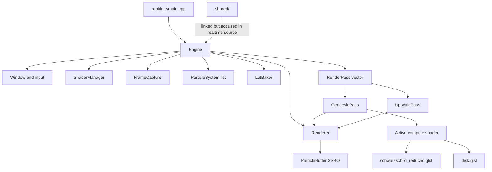

# Executive Summary

The realtime engine has achieved a useful **backend-local rendering architecture**, but not yet a durable **Penrose framework architecture**. Its strongest architectural move is the pass-oriented compute pipeline: `Engine` builds a `PassContext`, `GeodesicPass` performs ray/geodesic compute work, and `UpscalePass` presents the result. That gives the renderer a real extension point for rendering stages.

The main architectural weakness is that the realtime backend currently owns several concepts that are not purely rendering concerns: Schwarzschild metric behavior, reduced geodesic integration, observer/camera assumptions, particle state semantics, accretion disk physics, LUT baking, coordinate conventions, and metric identity. `shared/` is linked but not used by realtime source code, so the intended shared architecture is not yet operative.

Evidence: `Engine` owns render resources and domain objects together:

```30:48:realtime/core/Engine.h
    std::unique_ptr<Shader> screenShader;

    GLFWwindow* window;
    unsigned int width;
    unsigned int height;
    float rs;

    std::unique_ptr<Renderer> renderer;
    std::unique_ptr<ShaderManager> shaderManager;
    std::unique_ptr<FrameCapture> frameCapture;

    std::unique_ptr<Physics::AccretionDisk> accretionDisk;
    std::unique_ptr<FallingParticleSystem> fallingSystem;
    std::vector<ParticleSystem*> particleSystems;

    std::vector<std::unique_ptr<RenderPass>> passes;

    unsigned int skyboxTexture;
    unsigned int geodesicLUT;
```

# High-Level Architectural Model

The realtime engine is currently a **single executable backend** built from `realtime/core`, `realtime/render`, `realtime/scene`, `realtime/spacetime`, and `realtime/shaders`.

Its actual model is:



This is coherent as a standalone black-hole renderer. It is not yet structured as a renderer consuming backend-independent Penrose domain abstractions.

# Rendering Pipeline Overview

Per frame, `Engine::run()` handles input, updates particle systems, uploads particles, renders passes, optionally captures a frame, then swaps buffers.

`Engine::initAssets()` bakes a Schwarzschild LUT, loads a skybox, creates `Renderer`, creates `ShaderManager`, registers one compute metric shader, creates realtime particle systems, then appends two passes:

```84:133:realtime/core/Engine.cpp
void Engine::initAssets() {
    std::cout << "Baking LUT... This might take a second.\n";
    Physics::BakerConfig config;
    config.rs = rs;
    config.rMin = rs * 1.001f;
    std::vector<float> lutData = Physics::LutBaker::bakeSchwarzschildLUT(config);
    // ...
    renderer = std::make_unique<Renderer>(rw, rh);
    screenShader = std::make_unique<Shader>("shaders/common/screen.vert", "shaders/common/screen.frag");

    shaderManager = std::make_unique<ShaderManager>();
    shaderManager->setBasePath("shaders");
    shaderManager->loadMetricCompute(MetricType::SCHWARZSCHILD_REDUCED, "reduced.comp");
    shaderManager->setMetric(MetricType::SCHWARZSCHILD_REDUCED);
    // ...
    accretionDisk = std::make_unique<Physics::AccretionDisk>(50);
    fallingSystem = std::make_unique<FallingParticleSystem>();
    fallingSystem->setRs(rs);
    // ...
    passes.push_back(std::make_unique<GeodesicPass>(*renderer, *shaderManager));
    passes.push_back(std::make_unique<UpscalePass>(*renderer)); 
}
```

`GeodesicPass` dispatches the compute shader and binds skybox, LUT, particles, and output image. `UpscalePass` blits the compute output to the default framebuffer.

# Dependency Graph

At CMake level, `Penrose` links `penrose_shared`, but does not link `penrose_physics` or `visualization`. That is good backend isolation.

However, source-level realtime code does not include `shared/` types. A search under `realtime/` finds no use of `shared/state`, `shared/spacetime`, `MetricKind`, `State`, or `Observer`. So the dependency direction is currently:

- `realtime` depends on OpenGL, GLFW, GLM, shaders, and its own domain helpers.
- `realtime` does not depend on `physics`.
- `realtime` does not depend on `visualization`.
- `realtime` nominally links `shared`, but does not consume it.

This means the module boundary is clean in the negative sense: realtime does not couple to scientific or visualization libraries. But it is not yet clean in the positive sense: realtime does not consume common abstractions from `shared/`.

# Subsystem Responsibilities

`Engine` is the composition root, application loop, resource owner, scene owner, metric selector, LUT baker, pass scheduler, input coordinator, and capture driver. This is too much architectural responsibility for long-term growth.

`Renderer` owns GPU output texture, dummy VAO, particle buffer upload, compute image binding, screen blit, and frame capture. These are rendering concerns and can remain realtime-owned.

`RenderPass` is a good rendering abstraction. It isolates pass execution behind `execute(const PassContext&)`. But `PassContext` directly carries realtime `Camera`, raw texture IDs, and `Shader*`, so the abstraction is currently tied to this backend’s concrete scene and GL resource model.

`ShaderManager` is a shader registry and include resolver. It is a rendering concern, but its public identity model is `MetricType`, which is a domain concern. Today it only knows `SCHWARZSCHILD_REDUCED`:

```9:21:realtime/core/ShaderManager.h
enum class MetricType {
    SCHWARZSCHILD_REDUCED
};

class ShaderManager {
public:
    ShaderManager() = default;
    ~ShaderManager() = default;

    void setBasePath(const std::string& path) { m_basePath = path; }
    void loadMetricCompute(MetricType type, const std::string& computePath);
    void setMetric(MetricType type);
    Shader* getActive() const;
```

`ParticleSystem` is backend-local animation input for GPU particles. It is useful for realtime effects, but it is not a backend-independent scene abstraction.

`LutBaker` and `AccretionDisk` are misplaced under `realtime/spacetime`. They are not general spacetime abstractions. They are realtime-specific Schwarzschild/rendering helpers.

# Ownership Boundaries

Renderer-owned abstractions:

- `Renderer`
- `RenderPass`
- `GeodesicPass`
- `UpscalePass`
- `Shader`
- `ShaderManager`, except for its metric-domain naming
- `ParticleBuffer`
- GL textures, SSBOs, compute images, presentation shaders

Shared-domain candidates:

- Metric identity and parameters
- Coordinate chart identity
- Observer/camera model
- Trajectory/state representation
- Scene description for trajectories, disks, horizons, emitters
- Simulation/render configuration vocabulary

Misplaced responsibilities:

- `realtime/spacetime/LutBaker` owns Schwarzschild reduced geodesic integration.
- `realtime/shaders/metrics/schwarzschild_reduced.glsl` owns metric physics.
- `realtime/scene/Particle.h` documents spherical state semantics but is used as Cartesian GPU layout.
- `Engine` owns `rs`, metric selection, LUT parameterization, camera, scene objects, resources, and pass scheduling.

# Compatibility With The Shared Architecture Vision

The current architecture is only **partially compatible**.

It already respects one important rule: realtime does not link against `penrose_physics` or `visualization`. That allows independent evolution.

But it does not yet implement the intended convergence toward `shared/` because realtime does not consume shared abstractions. `shared/` already defines `State`, `Spacetime::Metric`, `MetricKind`, `CoordinateChartKind`, `Observer`, and `SchwarzschildParameters`, while realtime defines parallel or implicit versions.

Shared state:

```6:10:shared/state/GeodesicState.h
// Geodesic state: position X and tangent U in a chosen coordinate chart.
struct State {
    Vector4d X;
    Vector4d U;
```

Realtime particle state:

```4:10:realtime/scene/Particle.h
struct Particle {
    glm::vec4 stateX;      // x.x = time, x.y = r, x.z = theta, x.w = phi (matches your ray struct)
    glm::vec4 stateU;      // u.x = vt, u.y = vr, u.z = vtheta, u.w = vphi
    glm::vec3 color;       // RGB color
    float mass;            // Mass of particle
    float radius;          // Radius for collision/rendering
```

But `AccretionDisk` writes `stateX` as Cartesian `(x, y, z, r)`, not `(t, r, theta, phi)`. That is a concrete example of a domain abstraction being duplicated without a stable shared contract.

# Extension Points

Good extension points already present:

- Add a new render pass by implementing `RenderPass`.
- Add a new particle producer by implementing `ParticleSystem`.
- Add shader includes through `ShaderManager::resolveIncludes`.
- Add a new compute shader by registering it in `ShaderManager`.
- Adjust presentation by replacing `UpscalePass` or `screen.frag`.

Weak extension points:

- Adding a new metric requires changing `MetricType`, changing `Engine::initAssets()`, adding shader files, and ensuring `GeodesicPass` uniform/resource assumptions match the new shader.
- Adding a new camera model requires changing `PassContext`, input handling, `Camera`, and likely `GeodesicPass`.
- Adding externally generated trajectories has no natural path into realtime; visualization has `TrajectoryAdapter`, realtime does not.
- Adding coordinate systems would require untangling implicit Cartesian/spherical assumptions across C++, GLSL, particles, camera, disk, and ray march code.

# Architectural Strengths

The pass pipeline is a real improvement over a monolithic draw loop. `RenderPass` lets the frame be composed from discrete rendering stages.

The renderer is correctly isolated from `physics` and `visualization` at the build level. This prevents accidental linkage of scientific engine internals into realtime.

The compute-shader architecture is a plausible long-term rendering backend strategy. It can support GPU ray marching, foveated rendering, alternate presentation passes, and future compute-heavy techniques.

Shader include resolution gives GLSL some modularity. `reduced.comp` includes metric and common visual modules, rather than having one giant shader file.

The particle upload path is backend-local and appropriately GPU-oriented. `ParticleBuffer` owning SSBO upload/binding is a rendering concern.

# Hidden Assumptions

The renderer assumes Schwarzschild reduced equatorial geodesics. The shader hardcodes `rs` and the reduced ODE:

```5:10:realtime/shaders/metrics/schwarzschild_reduced.glsl
const float rs = 0.25;

void orbitDerivative(float u, float v, out float du, out float dv) {
    du = v;
    dv = -u + 1.5 * rs * u * u;
}
```

It assumes a camera-centric orbital plane derived from `cross(ro, rd)`. That is not a general coordinate-system or observer model.

It assumes OpenGL 4.3 compute shaders, image load/store, SSBOs, and GLSL-side particle layouts.

It assumes the rendering technique is ray marching plus live RK4 stepping. The LUT is sampled in `reduced.comp`, but the sampled values are not used to drive the march.

It assumes a world-fixed accretion disk in `disk.glsl` using `currentPos.xy`, `currentPos.z`, fixed `DISK_INNER`, `DISK_OUTER`, and `DISK_HEIGHT`.

It assumes a first-person camera with GLM vectors and GLFW input, not a shared observer/camera abstraction.

It assumes scene content is a flat list of particle systems plus hardcoded skybox/disk/LUT resources.

# Architectural Weaknesses

The largest weakness is responsibility concentration in `Engine`. It owns platform setup, render resources, shader registration, metric parameters, scene construction, input, frame loop, pass scheduling, particle aggregation, and LUT baking.

The second major weakness is physics duplication. Schwarzschild behavior exists in `physics`, `LutBaker.cpp`, and GLSL. Those copies are not connected through a shared metric contract.

The third weakness is ambiguous data semantics. `shared::State` explicitly means position/tangent in a coordinate chart, while realtime `Particle::stateX` is documented as spherical but used as Cartesian by `AccretionDisk`, `FallingParticleSystem`, and shader intersection.

The fourth weakness is that shader pipeline identity is domain-specific but not shared-domain-backed. `MetricType::SCHWARZSCHILD_REDUCED` is renderer-owned, not `Spacetime::MetricKind`.

The fifth weakness is that rendering pass configuration is hardwired. `GeodesicPass` owns projection construction, LUT bounds, texture bindings, dispatch dimensions, and metric shader assumptions. Future metric pipelines will likely require changes to this class.

# Stress Test Results

Arbitrary spacetime metrics: fits conceptually in `ShaderManager`, but today requires changing `MetricType`, `Engine`, shader contracts, and likely `GeodesicPass`. This is not “add only a module.”

Interchangeable rendering techniques: `RenderPass` helps. A new technique can be another pass, but shared camera, scene, and resource contracts are too concrete, so multiple techniques would pressure `PassContext`.

New shader pipelines: possible, but `ShaderManager` is compute-metric-specific. Fragment, multipass, compute-preprocess, or hybrid pipelines would require expanding the manager model.

New scene representations: no natural shared scene input exists. `Engine` owns concrete particle systems directly.

New camera models: current `Camera` is a GLFW first-person rendering camera. General observers would require changes to `Camera`, `PassContext`, input, and projection logic.

New observer models: no natural fit. `shared/observer/Observer.h` exists but is unused.

Multiple coordinate systems: high friction. Coordinate assumptions are embedded in particle comments, disk generation, shader ray march, and visualization adapters separately.

Visualization of externally generated trajectories: currently no realtime equivalent of `visualization/Trajectory/TrajectoryAdapter.h`. This would require a new adapter and probably new GPU buffer contracts.

Renderer consuming Scientific Engine outputs: build isolation permits it through `shared`, but realtime has no shared state ingestion boundary.

Backend-independent scene descriptions: absent. `visualization` has a `viz::Scene`; realtime has no comparable scene model.

Future GPU compute features: the OpenGL compute foundation supports this reasonably well, but resource scheduling and pass contracts are still simple and centralized.

Future HPC-oriented rendering workflows: weak fit. The current executable is interactive GLFW/OpenGL-first, with frame capture as a side path, not an offline or headless rendering backend abstraction.

# Missing Abstractions

The missing abstractions are not numerous, but they are fundamental.

A backend-independent scene or render-input description is missing. It should describe trajectories, observers, metric parameters, horizons, disks, and visualization intent without owning GL buffers.

A shared observer/camera model is missing. Realtime’s first-person camera is a control device, not the same thing as a scientific observer.

A metric-to-renderer contract is missing. Realtime needs a way to consume metric identity and parameters from `shared` while still using GPU-specific shader implementations.

A coordinate conversion boundary is missing. The renderer needs explicit conversion from shared coordinate-chart states into GPU layouts.

A shader pipeline descriptor is missing. `MetricType` is not enough to describe resource bindings, uniforms, LUT needs, compute passes, and presentation strategy.

# Future Refactoring Risks

The next major refactor will likely be triggered by adding either Kerr or external trajectory visualization.

Kerr would break the reduced Schwarzschild assumptions in `schwarzschild_reduced.glsl`, `LutBaker`, `GeodesicPass`, `MetricType`, and `Engine::initAssets()`. The root cause is that metric physics is embedded inside the renderer rather than selected through a shared-domain metric/render pipeline contract.

External trajectory visualization would expose the absence of a shared scene ingestion layer. The root cause is that realtime currently creates its own scene procedurally instead of consuming backend-independent scene or trajectory descriptions.

A third likely trigger is generalized observers. The root cause is conflating camera controls, view matrix generation, and observer semantics inside one realtime `Camera`.

# Overall Assessment

The realtime engine is a promising standalone GPU renderer with a credible pass-based internal structure. It is not architecturally chaotic; the rendering pipeline has a clear flow, and build boundaries prevent direct dependency on the scientific engine.

But as a long-term Penrose backend, it is still anchored to its original identity: a Schwarzschild black-hole renderer. The evidence is the single `SCHWARZSCHILD_REDUCED` metric enum, hardcoded `rs`, duplicated reduced ODEs, realtime-owned LUT baker, implicit coordinate assumptions, and lack of actual `shared/` consumption.

The current architecture can evolve, but not naturally by only adding modules. Several future capabilities would require modifying existing core components, especially `Engine`, `ShaderManager`, `GeodesicPass`, shader contracts, and scene data flow.

# Verdicts

1. **Has the realtime rendering engine actually achieved a modular architecture suitable for long-term growth?**

Partially, but not fully. It has modular rendering mechanics through `RenderPass`, `Renderer`, and `ShaderManager`. It has not achieved modular scientific-framework architecture because domain concepts and Schwarzschild physics are still owned inside realtime.

2. **Can the realtime rendering engine naturally integrate into the envisioned `shared/` architecture without another fundamental redesign?**

No. It can integrate without throwing away the rendering pipeline, but it will need a real architectural reorganization around shared scene, observer, metric, coordinate, and trajectory contracts. The required redesign is not a rewrite of the GPU renderer; it is a redesign of the boundary between Penrose domain abstractions and realtime GPU implementation.