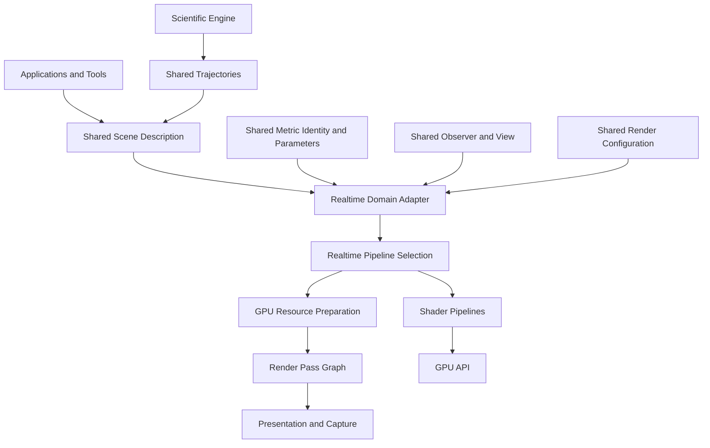

# Realtime Architectural Evolution Roadmap

## Executive Direction

Penrose should evolve the realtime engine from a specialized Schwarzschild renderer into a backend that consumes domain descriptions from `shared/` and translates them into GPU execution. The key is not to rewrite the renderer, but to move architectural authority outward: `shared/` owns scientific vocabulary; realtime owns GPU realization.

The correct migration path is incremental:

1. Stabilize ownership boundaries.
2. Introduce shared domain contracts.
3. Adapt realtime to consume those contracts.
4. Generalize pipelines only after the domain boundary is clear.
5. Support new metrics, observers, scenes, and backends through extension.

## Short-Term Goals

### 1. Define The Realtime Boundary

The next architectural step should be to decide what realtime owns and what it only consumes.

Realtime should own rendering resources, GPU buffers, shader pipelines, render passes, frame scheduling, interactive controls, and presentation. It should not own metric identity, coordinate semantics, observer definitions, trajectory meaning, or scientific scene concepts.

This should happen now because current realtime classes mix rendering and domain authority. Delaying this allows every new feature to deepen the coupling.

It enables later migration because each subsystem can be evaluated against a clear rule: domain vocabulary belongs above realtime; GPU realization belongs inside realtime.

### 2. Separate Domain Input From GPU Representation

The renderer needs an architectural distinction between “what the scene means” and “how the GPU consumes it.”

Today, particles, camera, disks, and geodesic inputs are represented directly in realtime-friendly forms. That is acceptable for rendering, but not as the framework’s source of truth.

This solves the ambiguity where realtime `Particle` looks like a geodesic state but behaves like a GPU layout. It enables future trajectory ingestion, multiple coordinate charts, and renderer-independent scene descriptions.

### 3. Move Metric Identity Out Of Realtime

Realtime should stop being the authority on metric identity. It can still own GPU shader pipelines for metrics, but the identity and parameters of a spacetime should come from `shared/`.

This matters now because the existing metric selection model is already Schwarzschild-specific. Adding Kerr before fixing this would make the renderer’s private metric registry the de facto framework registry.

This enables additional metrics without turning `ShaderManager`, `Engine`, and shader registration into a growing domain model.

### 4. Clarify Observer Versus Interactive Camera

The realtime camera should be treated as an interactive control/view implementation, not the canonical observer model.

This solves a core conceptual leak: scientific observers and user-controlled cameras are related but not identical. A scientific observer may carry frame, chart, velocity, time, and measurement semantics; a realtime camera carries input state and view transforms.

This enables generalized observer models, offline rendering, scientific replay, and externally configured camera paths.

### 5. Treat Current Schwarzschild Rendering As One Pipeline

The current geodesic pass, LUT baker, reduced shader, accretion disk, and skybox behavior should be architecturally classified as one concrete realtime pipeline, not as the renderer itself.

This should happen before adding more rendering modes. Otherwise, Schwarzschild-specific assumptions will remain embedded in the core path and every new metric will be forced to conform to them.

This enables future rendering techniques to coexist without rewriting the current one.

## Medium-Term Goals

### 1. Establish A Shared Scene Description

Before supporting many scene types, Penrose needs a backend-independent scene description owned outside realtime.

That scene description should express domain intent: spacetime, observer, trajectories, emitters, horizons, disks, visualization layers, time controls, and rendering intent. It should not expose GPU buffers, shaders, OpenGL resources, or realtime-specific controls.

This reduces friction because realtime becomes an adapter from shared scene descriptions to GPU render data, while future offline or HPC renderers can consume the same scene at a different fidelity.

### 2. Introduce A Metric Rendering Contract

Additional metrics should not be added directly to the current shader enum model. Penrose needs a boundary between shared metric identity and backend-specific metric realization.

The shared layer should describe what metric is requested and what parameters define it. The realtime backend should decide whether it has a compatible GPU pipeline for that metric.

This prevents shared architecture from depending on GLSL details, while also preventing realtime from inventing domain identities privately.

### 3. Refine The Rendering Pipeline Model

The existing pass architecture is a good base, but medium-term growth needs the concept of a rendering pipeline, not just a list of passes.

A pipeline should own the relationship among scene input, metric realization, resource preparation, render passes, and presentation. Different techniques can then have different pipeline structures.

This reduces future friction because new rendering techniques become alternate pipelines rather than conditional behavior inside `GeodesicPass` or `Engine`.

### 4. Define Adaptation Boundaries

Realtime should contain adapters that translate shared descriptions into GPU-ready forms. This is the correct home for coordinate conversion into render-space, buffer packing, shader parameter preparation, and resource binding decisions.

This keeps `shared/` independent of GLM/OpenGL/GLSL while still allowing realtime to consume shared semantics cleanly.

### 5. Decouple Engine Composition From Domain Construction

The realtime engine should evolve toward being a runtime host for rendering systems, not the place where spacetime, scene, metric, and particle meaning are constructed.

This enables applications and tools to provide scenes from scientific simulations, scripts, files, or interactive setup without changing the realtime backend itself.

## Long-Term Goals

In the long-term architecture, Penrose should converge toward this responsibility split:

```text
shared/
  owns domain vocabulary:
    spacetime identity
    metric parameters
    coordinate charts
    observers
    cameras as domain views
    trajectories
    scene descriptions
    simulation/render configuration
    common math/domain objects

Scientific Engine
  owns scientific simulation:
    geodesic dynamics
    integrators
    validation
    trajectory generation
    numerical accuracy policies

Realtime Rendering Engine
  owns realtime realization:
    GPU resources
    shader pipelines
    render passes
    realtime scene adapters
    interactive controls
    frame scheduling
    presentation
    GPU-specific acceleration

Other Rendering Backends
  own their own realization:
    offline rendering
    headless export
    HPC workflows
    alternate APIs
```

The realtime dependency direction should be:

```text
Applications / Tools
        ↓
shared scene/configuration
        ↓
Realtime Rendering Engine
        ↓
GPU API / shaders
```

The Scientific Engine should not feed realtime through private physics classes. It should emit shared trajectories, states, configurations, and scene descriptions that realtime can consume.

## Shared Architecture Migration By Subsystem

### `Engine`

Classification: should be split into multiple responsibilities.

Architectural reasoning: `Engine` currently owns application loop, window setup, render resources, scene construction, metric choice, LUT baking, particle systems, and pass scheduling. Long-term it should remain the realtime host, but domain construction should move outside it.

It should eventually consume shared scene/configuration inputs and compose backend-local rendering systems around them.

### `Renderer`

Classification: remains entirely inside the realtime backend.

Architectural reasoning: `Renderer` owns GPU output textures, particle buffer binding, blit behavior, and capture behavior. These are backend-specific rendering responsibilities.

It should not move into `shared/`, and it should not expose framework-domain abstractions.

### `RenderPass`

Classification: remains inside realtime, but should expose backend-local extension points.

Architectural reasoning: render passes are GPU execution units. They are not shared-domain concepts. Other backends may have analogous concepts, but not the same interface.

Its architectural role should remain backend-local composability.

### `PassContext`

Classification: should be split into multiple responsibilities.

Architectural reasoning: it currently mixes camera, timing, dimensions, raw texture IDs, LUT, and shader pointers. Some of that is frame context, some is render resource state, and some is domain input.

Long-term, domain-derived input should come from shared scene/observer descriptions, while GPU handles remain backend-local.

### `ShaderManager`

Classification: remains inside realtime, but should consume abstractions from `shared/`.

Architectural reasoning: shader compilation, include resolution, and shader selection are realtime concerns. Metric identity and parameters are not.

It should map shared metric/render requests to realtime shader pipelines, rather than defining the framework’s metric vocabulary itself.

### `MetricType`

Classification: should be replaced by a more general abstraction.

Architectural reasoning: current `MetricType` is both shader registry key and metric identity. That conflates backend implementation with domain concept.

The long-term architecture needs shared metric identity plus backend-specific pipeline availability.

### `GeodesicPass`

Classification: remains inside realtime, but should become one concrete rendering technique.

Architectural reasoning: it owns GPU ray/geodesic execution. That is realtime-specific. But it currently also embeds assumptions about projection, LUT bounds, Schwarzschild behavior, resource bindings, and shader contract.

It should remain as a concrete pipeline component, not as the universal rendering path.

### `UpscalePass`

Classification: remains entirely inside realtime.

Architectural reasoning: presentation/upscaling is a rendering concern. It should evolve as part of realtime’s presentation pipeline, not shared architecture.

### `Camera`

Classification: should be replaced by a more general abstraction at the domain boundary, while retaining a realtime control implementation.

Architectural reasoning: the current camera is an interactive GLFW/GLM view controller. That belongs in realtime. But observer/camera semantics for scientific rendering should live in `shared/`.

The realtime camera should adapt from or control a shared observer/view description rather than define one.

### `Particle`

Classification: should be split into domain particle/trajectory concepts and backend GPU layout.

Architectural reasoning: realtime `Particle` is a GPU payload. Its current name and state fields imply domain meaning, but its actual role is render-buffer layout.

Domain trajectories, particles, and geodesic states should be shared concepts. GPU layout should remain realtime-owned.

### `ParticleSystem`

Classification: should remain inside realtime for procedural visual effects, but should consume shared scene inputs where appropriate.

Architectural reasoning: procedural realtime emitters are backend-local. But externally generated particles or trajectories should enter through shared descriptions, not through realtime-only systems.

### `AccretionDisk`

Classification: should be split into domain description and rendering realization.

Architectural reasoning: an accretion disk can be a scene/domain object, a particle emitter, a volumetric shader, a mesh, or a scientific model. Realtime currently owns one procedural particle version and one shader version.

Long-term, shared should describe the disk concept and parameters; realtime should own the chosen rendering realization.

### `LutBaker`

Classification: should be replaced by a more general backend preparation concept.

Architectural reasoning: a LUT baker is a GPU-acceleration preparation step, not a general spacetime abstraction. The current one also owns Schwarzschild reduced integration.

Long-term, realtime may still prepare LUTs, but from shared metric/render descriptions rather than private metric logic.

### GLSL Metric Shaders

Classification: remain entirely inside realtime, but consume shared-domain configuration indirectly.

Architectural reasoning: GLSL is backend implementation. It should not be shared framework API. But the parameters and metric identity used to select it should be shared-domain inputs.

### `shared/`

Classification: should own backend-independent domain abstractions.

Architectural reasoning: `shared/` is the intended place for state, coordinate charts, observers, metric identity, metric parameters, trajectories, scene descriptions, and configuration vocabulary.

It should not own OpenGL resources, shader contracts, realtime input controls, or GPU layout.

## Architectural Ordering

### Stage 1: Establish Ownership Vocabulary

Prerequisite: current architecture review.

This must happen first because every later migration depends on knowing whether a concept is domain-level or backend-level.

Later changes depending on it: scene description, metric contract, observer separation, trajectory ingestion.

### Stage 2: Define Shared Domain Inputs

Prerequisite: ownership vocabulary.

Before changing renderer internals, Penrose needs stable shared concepts for the renderer to consume. Otherwise, realtime may be refactored toward abstractions that will be replaced later.

Later changes depending on it: scientific engine integration, backend-independent scenes, external trajectory visualization.

### Stage 3: Add Realtime Adaptation Boundary

Prerequisite: shared domain inputs.

Once shared inputs exist, realtime should gain a clear boundary that translates domain descriptions into GPU resources and render-pipeline inputs.

Later changes depending on it: multiple scene types, multiple coordinate systems, offline/realtime parity.

### Stage 4: Reclassify Current Schwarzschild Path As A Concrete Pipeline

Prerequisite: adaptation boundary.

The existing path should become one backend pipeline consuming a shared metric/scene request. This preserves current functionality while preventing it from defining the whole engine.

Later changes depending on it: Kerr pipeline, FLRW pipeline, alternative rendering modes.

### Stage 5: Generalize Pipeline Selection

Prerequisite: at least one concrete pipeline expressed through the new boundary.

Only after the current pipeline is properly classified should Penrose introduce broader pipeline selection. Doing this too early would generalize around the wrong assumptions.

Later changes depending on it: multiple rendering techniques, quality modes, headless/offline variants.

### Stage 6: Integrate Scientific Engine Outputs

Prerequisite: shared trajectories, observers, scene descriptions, and realtime adapters.

Scientific integration should happen after the renderer can consume shared descriptions. Otherwise integration will create direct backend coupling.

Later changes depending on it: validation visualization, replay tools, research workflows, HPC outputs.

### Stage 7: Support Multiple Backends

Prerequisite: shared descriptions proven by at least Scientific Engine plus realtime integration.

Other rendering backends should not be designed too early. They should be informed by real shared-domain usage, not speculative generalization.

## Future Architecture

The future realtime architecture should look like this:



Major extension points should be:

- New metric: add shared metric description plus realtime pipeline support.
- New rendering technique: add backend-local pipeline.
- New scene object: add shared scene concept plus backend adapter support.
- New observer model: add shared observer semantics plus backend view realization.
- New backend: consume the same shared scene/configuration model with different realization.

The key architectural goal is that new science enters through `shared/`, and new rendering enters through backend-local extension points.

## Architectural Priorities

### 1. Establish Shared Domain Ownership

This is the highest priority because it prevents realtime from becoming the accidental owner of Penrose’s scientific vocabulary.

It prevents future metric, observer, trajectory, and scene concepts from being duplicated per backend.

Delaying it increases refactoring cost sharply because every new feature will create more private domain models.

### 2. Create A Renderer Input Boundary

Realtime needs a boundary between shared descriptions and GPU representation.

This prevents GPU buffer layouts, shader assumptions, and realtime controls from leaking into framework-level concepts.

Delaying it makes scientific integration harder because external outputs will have to target realtime internals.

### 3. Separate Observer Semantics From Interactive Camera Control

This is architecturally important because observers are scientific/domain concepts, while camera controls are backend interaction mechanisms.

It prevents offline rendering, scientific replay, and interactive visualization from competing over one camera abstraction.

Delaying it increases cost when non-interactive rendering or externally configured viewpoints arrive.

### 4. Reframe Schwarzschild As One Pipeline, Not The Renderer

The current Schwarzschild path should be preserved, but demoted architecturally from “engine behavior” to “one concrete rendering pipeline.”

This prevents Kerr, FLRW, custom metrics, and non-geodesic visualization modes from being forced through Schwarzschild-era assumptions.

Delaying it makes every new metric more invasive.

### 5. Introduce Backend-Independent Scene Descriptions Before Adding Scene Variety

Scene variety should not be added directly to realtime first.

A shared scene description prevents accretion disks, trajectories, horizons, emitters, and visualization layers from being reinvented separately by realtime, visualization, offline, and future HPC backends.

Delaying it creates duplicated scene models that will eventually need reconciliation.

## Final Roadmap Assessment

The realtime engine should not be rewritten. Its rendering core is useful and should be preserved.

The architectural evolution should instead move domain authority upward into `shared/`, then make realtime a disciplined consumer of shared descriptions and a strong owner of GPU realization.

The correct destination is:

- `shared/` defines what is being rendered.
- Scientific Engine computes physically meaningful data.
- Realtime decides how to render it interactively.
- Other backends decide how to render it differently.
- New capabilities are added by extending shared domain descriptions and backend pipelines, not by modifying the realtime engine’s core identity.