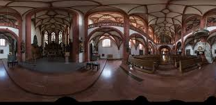
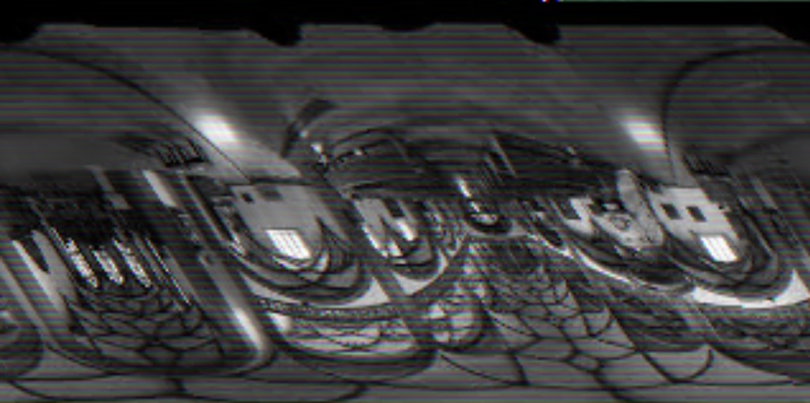

# Bug Report: Equirectangular Texture Skewing and Distortion

## Description
When loading certain environment maps for the skybox, the resulting rendered texture appears severely distorted, diagonally sheared, and discolored. 

## Visual Evidence
**Expected Outputs:**


**Actual Bugged Output:**


## Strategies:
The possible problems could have been in the shaderm so that was commented to eliminate that. Then it could have been the format ofimages and image sizing but te code was implemented to be independent of size or format of image. But the actual bug was found to be as follows

## Root Cause: Byte Alignment Mismatch
This is an OpenGL pixel unpack alignment issue. By default, OpenGL expects the start of each row of pixels in a texture to be aligned to a **4-byte boundary**. 

When loading an RGB image (3 bytes per pixel) using `stb_image` where the image width is not a perfect multiple of 4, the total bytes per row do not align with OpenGL's expectation. OpenGL ends up skipping/offsetting bytes at the end of every row, which shifts subsequent rows and creates the cascading diagonal skew.

## Resolution
Applied a fix to ensure OpenGL reads the data correctly. This can be resolved using one of the following methods:

**Change OpenGL Unpack Alignment**
Tell OpenGL to use a 1-byte alignment so it doesn't expect padded rows.
```cpp
// Set alignment to 1 byte before uploading texture data
glPixelStorei(GL_UNPACK_ALIGNMENT, 1);
glTexImage2D(GL_TEXTURE_2D, 0, format, width, height, 0, format, GL_UNSIGNED_BYTE, data);