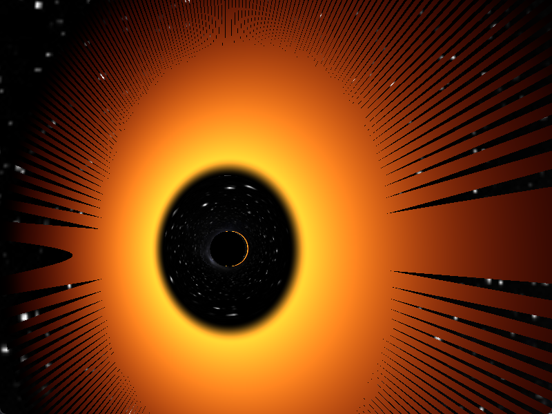
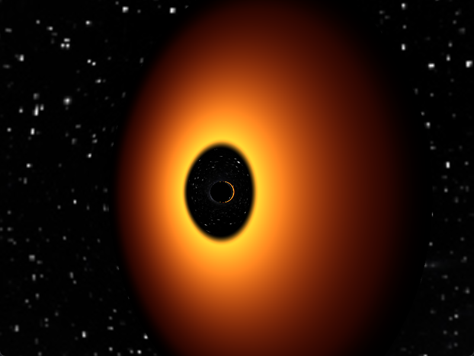
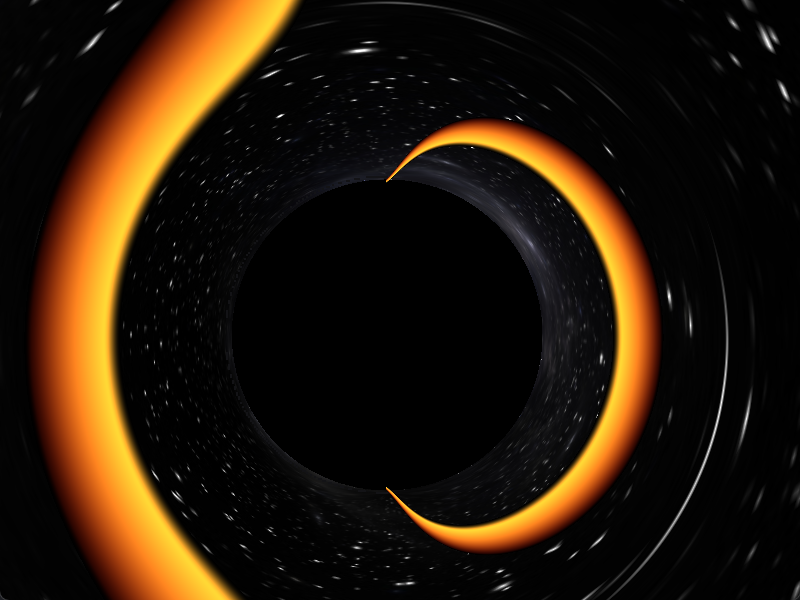

# Funny Chopped Disk Bug

While rendering the accretion disk, there were moments of discontinuity in the disk.    


# The issue

``` opengl
bool entersDisk =
    (abs(z0) > DISK_HALF_THICKNESS) &&
    (abs(z1) <= DISK_HALF_THICKNESS);
 ```
 Disk has a pre-defined thickness, during the raymarch loop we iterate it by some angular jump , however this causes the rays to jump drastically throughout the region, causing the clipping of the disk.

# The fix 

Use Exact Plane Intersection instead checking the disk region volumetrically.
The disk can be treated as a 2D plane with some thickness on z=0 , detect a collision simply by checking whether rays coordinate is flipped from positive to negative, use basic interpolation to determine where the ray lands
We use 

```opengl
bool crossesEquator = (z0 * z1) <= 0.0;
```
# The result
Smooth Disk Formation


# Underlying issue
However there is a underlying artifact yet to be resolved it's noticeable near the centre in both images, more evident in the third image

