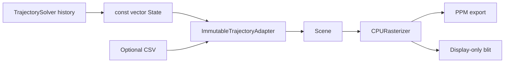

# Penrose CPU Visualization

Standalone CPU software visualization for Penrose trajectories. The module is scene-based (multiple trajectories, static geometry, cameras) and independent of the GPU raymarcher in `realtime/`.

## Architecture

```text
visualization/
├── Trajectory/     Immutable trajectory samples + State/CSV adapters
├── Scene/          Scene graph, playback, static Schwarzschild props
├── Camera/         Orbit / pan / zoom camera
├── Geometry/       Math, local spherical→Cartesian, meshes
├── Renderer/       Headless CPU rasterizer (color + depth buffers)
├── Presentation/   Cinematic post-process (bloom, lensing warp, color grade)
├── IO/             Optional CSV import, PPM export, output paths
├── Apps/           Interactive viewer + headless CLI
└── Tests/          Unit/golden tests (determinism, adapters, camera)
```

### Data flow

1. **Primary path:** `const std::vector<State>&` / `std::span<const State>` enters `TrajectoryAdapter`, which converts Schwarzschild spherical samples to immutable Cartesian trajectories using a **local** `spherical_to_cartesian` (no `CoordinateChart` dependency).
2. **Secondary path:** optional benchmark CSV files (`freefall.csv`, `orbital.csv`, `null_b_{b}.csv`) load into the same immutable `Trajectory` type. CSV rows missing `theta` infer equatorial `theta = π/2`.
3. Trajectories and static geometry are assembled into a `Scene`.
4. `CPURasterizer` renders the scene deterministically into a CPU framebuffer.
5. `PresentationPipeline` optionally applies cinematic post-processing (bloom, vignette, color grade, non-physical lensing warp).
6. Output is either:
   - **Headless:** PPM still or frame sequence via `visualization_export` → `outputs/rendered_frames/<timestamp>/`
   - **Interactive:** GLFW/OpenGL **display-only** texture blit via `visualization_viewer` (no GPU scene rendering)



### Scene contents

A default Schwarzschild scene (`rs = 1`) includes:

- Black hole core and event-horizon sphere
- Translucent photon-sphere reference shell
- Annular accretion disk (equatorial plane)
- Reference ring
- Deterministic starfield background
- One or more trajectory trails with lit markers and glow

No GR lensing or metric evaluation is performed at render time.

## Build

From the repository root (same vcpkg toolchain as the rest of Penrose):

```bash
cmake -B build -S .
cmake --build build --target visualization visualization_test visualization_export
cmake --build build --target visualization_viewer   # optional, ON by default
```

CMake targets:

| Target | Type | Description |
|---|---|---|
| `visualization` | static library | Headless CPU visualization core |
| `visualization_test` | executable | Unit/golden tests |
| `visualization_export` | executable | Headless still + PPM sequence CLI |
| `visualization_viewer` | executable | Interactive viewer (requires display) |
| `visualization_example` | executable | Direct `vector<State>` integration reference |

Disable the viewer with `-DPENROSE_BUILD_VIEWER=OFF`.

## Generated outputs

All artifacts use timestamped run directories under [`outputs/`](../outputs/):

| Category | Path |
|---|---|
| Benchmark CSVs, metrics, report | `outputs/benchmark_data/<timestamp>/` |
| Validation figures (PNG/PDF) | `outputs/validation_figures/<timestamp>/` |
| Renderer PPM exports | `outputs/rendered_frames/<timestamp>/` |

See [`docs/frame_capture/VISUALIZATION_GUIDE.md`](../docs/frame_capture/VISUALIZATION_GUIDE.md) for the complete user guide.

## Direct in-memory integration

See [`examples/direct_integration/main.cpp`](../examples/direct_integration/main.cpp) (target `visualization_example`) for the canonical reference.

```cpp
#include "Presentation/PresentationPipeline.h"
#include "Presentation/PresentationDefaults.h"
#include "Trajectory/TrajectoryAdapter.h"
#include "Scene/Scene.h"

std::vector<State> history = /* from TrajectorySolver::solve(...) */;
viz::Scene scene(viz::cinematic_scene_settings());
scene.add_trajectory(viz::adapt_states(history, {.name = "orbital"}));
viz::Camera camera;
viz::apply_cinematic_camera(camera);
viz::Framebuffer fb(1280, 720);
viz::PresentationPipeline pipeline;
scene.playback().time = scene.playback().duration;
pipeline.render(scene, camera, fb);
```

Only `physics/state/State.h` is included at the adapter boundary.

## Headless export CLI

```bash
# Single still (defaults to outputs/rendered_frames/<timestamp>/frame.ppm)
./build/visualization_export --csv outputs/benchmark_data/<timestamp>/orbital.csv

# Frame sequence for video tooling
./build/visualization_export \
  --csv outputs/benchmark_data/<timestamp>/null_b_2.599076.csv \
  --frames 120 \
  --width 1920 --height 1080

# Legacy debug presentation
./build/visualization_export --csv ... --classic
```

Convert PPM sequences with existing tooling under `realtime/visualization/ppm_to_video.py` or `docs/frame_capture/`.

## Interactive viewer

```bash
./build/visualization_viewer --csv physics/results/data/orbital.csv
```

### Controls

| Input | Action |
|---|---|
| Left drag | Orbit camera |
| Middle drag | Pan |
| Scroll | Zoom |
| Space | Play / pause |
| Left / Right | Scrub playback |
| Home / End | Jump to start / end |
| 1–9 | Select trajectory index |
| Escape | Quit |

Resize is handled via the framebuffer resize callback; the CPU renderer re-renders each frame and the result is blitted to an OpenGL texture.

## CSV schemas (optional)

| File pattern | Header | Notes |
|---|---|---|
| `freefall.csv` | `tau,r,vt,vr` | Radial infall; infers `phi=0`, `theta=π/2` |
| `orbital.csv` | `tau,r,phi,vt,vr,vph,norm` | Equatorial orbit |
| `null_b_{b}.csv` | `lambda,r,phi,vt,vr,vph,...` | Null geodesic |

## Extension points

- **Kerr / new metrics:** add trajectories via `adapt_states`; extend `SceneSettings` for ergosphere/horizon geometry.
- **Multiple particles / photon bundles:** call `Scene::add_trajectory` repeatedly; playback scrubs all trajectories by shared time.
- **Parameter sweeps:** build `SceneBuilder::from_trajectories` with a vector of adapted trajectories.
- **SGL ray sets:** add static polyline entities alongside trajectory objects (same rasterizer line path).
- **Materials / observables:** attach per-entity color and glow in `TrajectoryStyle` or future scene entity types.

## Determinism

Given identical scene data, camera parameters, framebuffer size, and `RenderOptions::starfield_seed`, the CPU rasterizer produces identical pixels across runs on the same platform. Floating-point differences across platforms are possible but minimized by fixed algorithms and integer star hashing.

## Tests

```bash
./build/visualization_test
```

Covers spherical→Cartesian conversion, immutable trajectory adaptation, CSV failure handling, camera projection, depth ordering via checksum stability, and PPM roundtrip.

## Scientific analysis (benchmark validation)

Read-only Python tooling under `scientific/` analyzes CPU benchmark CSVs from `outputs/benchmark_data/`:

```bash
# After running ./build/benchmark_test:
python -m visualization.scientific.analyze_benchmarks
python -m visualization.scientific.plot_benchmarks
python -m visualization.scientific.generate_report
```

Outputs:

| Artifact | Location |
|---|---|
| Validation report | `outputs/benchmark_data/<timestamp>/benchmark_validation.md` |
| Figures (PNG + PDF) | `outputs/validation_figures/<timestamp>/` |
| Metrics JSON | `outputs/benchmark_data/<timestamp>/benchmark_metrics.json` |

The analysis layer is intentionally separate from the CPU rasterizer: it reads benchmark CSVs only and does not modify physics sources.
